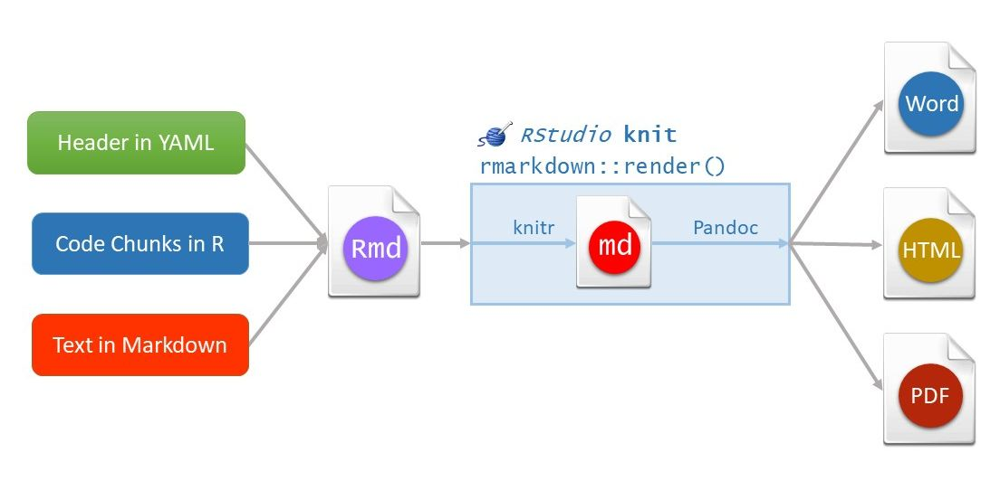

# RMarkdown

RMarkdown is a framework from RStudio for easily combining your code, data, text and interactive charts into both reports and slide decks. RMarkdown is based on Markdown.

## Markdown

Markdown is a markup language. It is an extremely simple markup language, so it is very popular on the Web and in other application. Markdown is used to format text on GitHub, Reddit, Stack Exchange, and Trello, and in RMarkdown.
Markap laguages allow authors to annotate content. The content could be anything from reports to websites. [HTML](https://www.w3schools.com/html/default.asp) is the most widely used markup language. 

Markdown was created by John Gruber and Aaron Swartz in 2004. Markup was designed that a human reader could easily parse the content. 

You can download an [example Markdown file](markdown_syntax.md) to illustrate the markdown syntax:

* Headings
* Paragraphs
* Line Breaks
* Emphasis (Bold, Italic)
* Blockquotes
* Lists (Ordered, Unordered)
* Code
* Horizontal Rules
* Links
* Images
* Tables
* Footnotes
* Definition Lists

It's important to note that Markdown comes in many different flavors (versions). There are several lightweight markup languages that are supersets of Markdown. They include Gruber’s basic syntax and build upon it by adding additional elements.

Many of the most popular Markdown applications use one of the following lightweight markup languages:

-   [CommonMark](https://commonmark.org/){target="_blank"}

-   [GitHub Flavored Markdown (GFM)](https://github.github.com/gfm/){target="_blank"}

-   [Markdown Extra](https://michelf.ca/projects/php-markdown/extra/){target="_blank"}

-   [MultiMarkdown](https://fletcherpenney.net/multimarkdown/){target="_blank"}

-   [R Markdown - Pandoc](https://rmarkdown.rstudio.com/){target="_blank"}

If you are not familiar with Markdown yet, or do not prefer writing Markdown code, RStudio v1.4 has included an experimental visual editor for Markdown documents, which feels similar to traditional WYSIWYG editors like Word. You can find the full documentation at [RStudio Visual R Markdown](https://rstudio.github.io/visual-markdown-editing/){target="_blank"}. With the visual editor, you can visually edit almost any Markdown elements supported by Pandoc, such as section headers, figures, tables, footnotes, and so on. 


**Additional resources about Markdown:**

* [Markdown Cheat Sheet](https://www.markdownguide.org/cheat-sheet/){target="_blank"}<br>
A quick reference to the Markdown syntax.
* [Basic Syntax](https://www.markdownguide.org/basic-syntax/){target="_blank"}<br>
The Markdown elements outlined in John Gruber's design document.
* [Extended Syntax](https://www.markdownguide.org/extended-syntax/){target="_blank"}<br>
Advanced features that build on the basic Markdown syntax.

## RMarkdown

R Markdown understands Pandoc’s Markdown, a version of Markdown with more features. [This Pandoc guide](https://pandoc.org/MANUAL.html#pandocs-markdown){target="_blank"} provides and extensive resource for formatting options.

Rmarkdown files are plain text files that contain all of the information necessary for RStudio to generate our output files, using **rmarkdown** and **knitr** package. There are three distinct parts to the document, and in fact, each is written in a different language.

* The file header tells the **rmarkdown** package what type of file to create. In this case, an HTML document. And it's worth noting that this header is written in [YAML](https://yaml.org/){target="_blank"}. 
* The text in the document is written in Pandoc flavored Markdown. 
* Any R code that we want to include or evaluate in a document is contained within code chunks. These are delimited by pairs of three back ticks. Note that these back ticks are actually part of the Pandoc Markdown syntax. This is the beauty of RMarkdown. It allows us to combine text, images, code, and output together into a huge variety of different output formats to create rich reports and presentations.

To use RMarkdown we need an R package available from CRAN, called **rmarkdown** that you need to install to use. And you install it in the same way as you install any R package, with the function `install.packages()`. The **rmarkdown** package is developed by the folks at RStudio. Therefore, the RStudio application is designed as the document editor for RMarkdown. R Markdown files have the extension `.Rmd`. It's not impossible to use R Markdown without RStudio, but RStudio makes it a real delight to use. The **rmarkdown** package is a collection of many different tools that work together to convert your RMarkdown files, into HTML, PDF, Microsoft Word documents, and many other file types. 

There are therefore two components of R Markdown: `.Rmd` file, which contains all of our content, and the **rmarkdown** package that passes the `.Rmd` file and generates to specify output files. 

The basic workflow structure for an RMarkdown document is shown in Figure \@ref(fig:rm-pic), highlighting the steps (arrows) and the intermediate files that are created before producing the output. The whole process is implemented via the function `rmarkdown::render()`. Each stage is explained in further detail below.

<div class="figure">

<p class="caption">(\#fig:rm-pic)A diagram illustrating how an R Markdown document is converted to the final output document.</p>
</div>


## Code Chunks

To run blocks of code in RMarkdown, use code chunks. Insert a new code chunk with:

* `Command + Option + I` on a Mac, or `Ctrl + Alt + I` on Linux and Windows.
* Another option is the “Insert” drop-down Icon in the toolbar and selecting R.

We recommend learning the shortcut to save time! We’ll insert a new code chunk in our R Markdown Guide in a moment.

### Running Code

RStudio provides many options for running code chunks in the “Run” drop-down tab on the toolbar.

Before running code chunks it is often a good idea to restart your R session and start with a clean environment. Do this with `Command + Shift + F10` on a Mac or `Control + Shift + F10` on Linux and Windows.

To save time, it’s worth learning these shortcuts to run code:

* Run all chunks above the current chunk with `Command + Option + P` on a Mac, or `Ctrl + Alt + P` on Linux and Windows.
* Run the current chunk with `Command + Option + C` or `Command + Shift + Enter` on a Mac. On Linux and Windows, use `Ctrl + Alt + C` or `Ctrl + Shift + Enter` to run the current chunk.
* Run the next chunk with `Command + Option + N` on a Mac, or `Ctrl + Alt + N` on Linux and Windows.
* Run all chunks with `Command + Option + R` or `Command + A + Enter` on a Mac. On Linux and Windows, use `Ctrl + Alt + R` or `Ctrl + A + Enter` to run all chunks.

### Control Behavior with Code Chunk Options

One of the great things about R Markdown is that you have many options to control how each chunk of code is evaluated and presented. This allows you to build presentations and reports from the ground up — including code, plots, tables, and images — while only presenting the essential information to the intended audience. For example, you can include a plot of your results without showing the code used to generate it.

Mastering code chunk options is essential to becoming a proficient RMarkdown user. The best way to learn chunk options is to try them as you need them in your reports, so don’t worry about memorizing all of this now. Here are the key chunk options to learn:

* `echo = FALSE`: Do not show code in the output, but run code and produce all outputs, plots, warnings and messages. The code chunk to generate a plot in the image below is an example of this.
* `eval = FALSE`: Show code, but do not evaluate it.
* `fig.show = "hide"`: Hide plots.
* `results = "hide"`: Hides printed output.
* `include = FALSE`: Run code, but suppress all output. This is helpful for setup code. 
* `message = FALSE`: Prevent packages from printing messages when they load. This also suppress messages generated by functions.
* `warning = FALSE`: Prevent packages and functions from displaying warnings.

### Navigating Sections and Code Chunks

Naming code chunks is useful for long documents with many chunks. With R code chunks, name the chunk like this: `{r my_boring_chunk_name}`.

With named code chunks, you can navigate between chunks in the navigator included at the bottom of the R Markdown window pane. This can also make plots easy to identify by name so they can be used in other sections of your document. This navigator is also useful for quickly jumping to another section of your document.


### Table Formatting

Tables in R Markdown are displayed as you see them in the R console by default. To improve the aesthetics of a table in an RMarkdown document, use the function `knitr::kable()`. Here’s an example:


```r
knitr::kable(head(cars), caption = "The First Few Rows of the Cars Dataset")
```


Table: (\#tab:unnamed-chunk-1)The First Few Rows of the Cars Dataset

| speed| dist|
|-----:|----:|
|     4|    2|
|     4|   10|
|     7|    4|
|     7|   22|
|     8|   16|
|     9|   10|

There are [many other packages](https://bookdown.org/yihui/rmarkdown-cookbook/table-other.html){target="_blank"} for creating tables in R Markdown.

## Inline Code

Directly embed R code into an R Markdown document with inline code. This is useful when you want to include information about your data in the written summary. We’ll add a few examples of inline code to our R Markdown Guide to illustrate how it works.

Use inline code with `r` and add the code to evaluate within the backticks. For example, here’s how we can summarize the number of rows and the number of columns in the cars dataset that’s built-in to R:

```rmarkdown

## Inline Code

The `cars` dataset contains 50 rows and 2 columns.
```


The example above highlights how it’s possible to reduce errors in reports by summarizing information programmatically. If we alter the dataset and change the number of rows and columns, we only need to rerun the code for an accurate result. This is much better than trying to remember where in the document we need to update the results, determining the new numbers, and manually changing the results. RMarkdown is a powerful because it can save time and improve the quality and accuracy of reports.


## Output Format Options

Now that we have a solid understanding about how to format an RMarkdown document, let's discuss format options. Format options that apply to the entire document are specified in the YAML header. R Markdown supports [many types of output formats](https://rmarkdown.rstudio.com/authoring_quick_tour.html#Output_Formats).

The metadata specified in the YAML header controls the output. A single RMarkdown document can support many output formats. There are two types of output formats in the **rmarkdown** package: documents, and presentations. All available formats are listed below:

-   `beamer_presentation`

-   `context_document`

-   `github_document`

-   `html_document`

-   `ioslides_presentation`

-   `latex_document`

-   `md_document`

-   `odt_document`

-   `pdf_document`

-   `powerpoint_presentation`

-   `rtf_document`

-   `slidy_presentation`

-   `word_document`

More details in <https://bookdown.org/yihui/rmarkdown/documents.html#documents>  and <https://bookdown.org/yihui/rmarkdown/presentations.html#presentations>. There are more output formats provided in other extension packages. For the output format names in the YAML metadata of an Rmd file, you need to include the package name if a format is from an extension package, e.g.,

    output: tufte::tufte_html

If the format is from the **rmarkdown** package, you do not need the `rmarkdown::` prefix (although it will not hurt).
 

Other packages provide even more output formats:

-   The **bookdown** package, <https://github.com/rstudio/bookdown>, makes it easy to write books, like this one. To learn more, read [*Authoring Books with R Markdown*](https://bookdown.org/yihui/bookdown/), by Yihui Xie, which is, of course, written in bookdown. Visit [<http://www.bookdown.org>](http://www.bookdown.org/) to see other bookdown books written by the wider R community.

-   The **prettydoc** package, <https://github.com/yixuan/prettydoc/>, provides lightweight document formats with a range of attractive themes.

-   The **rticles** package, <https://github.com/rstudio/rticles>, compiles a selection of formats tailored for specific scientific journals.

See <http://rmarkdown.rstudio.com/formats.html> for a list of even more formats. Also see [R Markdown Theme Gallery](https://www.datadreaming.org/post/r-markdown-theme-gallery/).


## Further topics and links

* Word documents<br>
<https://bookdown.org/yihui/rmarkdown-cookbook/word.html><br>
<https://rmarkdown.rstudio.com/articles_docx.html>
* Bibliography<br>
<https://bookdown.org/yihui/rmarkdown-cookbook/bibliography.html><br>
[Citation Style Language - Style Repository](https://github.com/citation-style-language/styles){target="_blank"}
* Cross-referencing within documents<br>
https://bookdown.org/yihui/rmarkdown-cookbook/cross-ref.html
* Create diagrams<br>
https://bookdown.org/yihui/rmarkdown-cookbook/diagrams.html


## Additional Resources

* [R Markdown Cookbook](https://bookdown.org/yihui/rmarkdown-cookbook/){target="_blank"}<br>
A comprehensive free online book that contains almost everything you need to know about RMarkdown.
* [RMarkdown for Scientists](https://rmd4sci.njtierney.com/){target="_blank"}
* [RStudio Articles for RMarkdown](https://support.rstudio.com/hc/en-us/sections/200149716-R-Markdown){target="_blank"}<br>
RStudio has published a few in-depth how to articles about using RMarkdown.
* [R for Data Science](https://r4ds.had.co.nz/index.html){target="_blank"}<br>
Hadley Wickham provides a great overview of authoring with RMarkdown.
* [R Markdown: The Definitive Guide](https://bookdown.org/yihui/rmarkdown/){target="_blank"}<br>
 It contains a large number of technical details, it may serve you better as a reference book than a textbook.
* [Online lesson from RStudio](https://rmarkdown.rstudio.com/lesson-1.html){target="_blank"}
* R Markdown Cheatsheet. RStudio has published numerous cheatsheets for working with R, including a detailed cheatsheet on using R Markdown! The R Markdown cheatsheet can be accessed from within RStudio by selecting `Help > Cheatsheets > R Markdown Cheat Sheet`.


