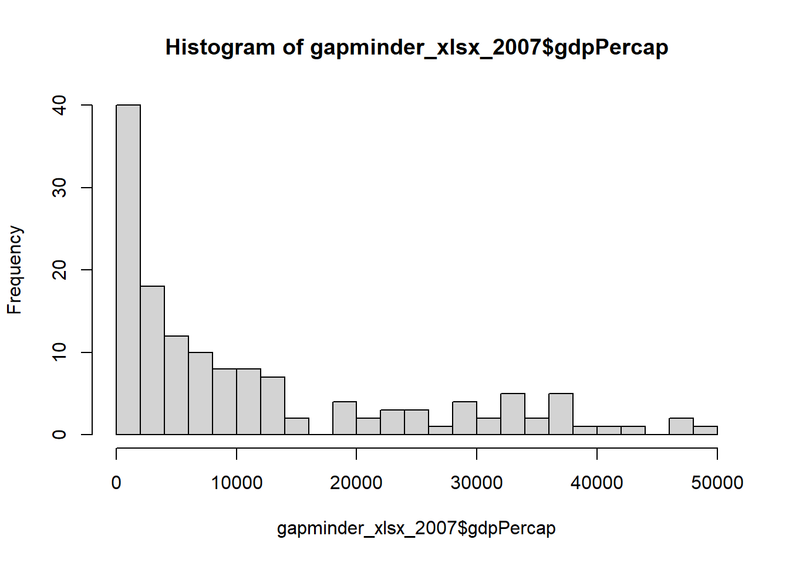
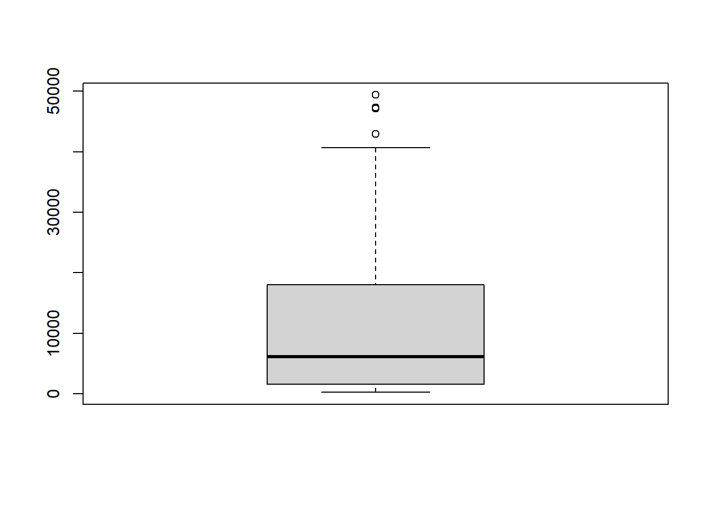

# Advanced data manipulation

This chapter focuses exclusively on advanced data manipulation. I therefore assume a basic level of comfort with data manipulation.

## Importing data

Most of the data used for analysis is found in the outside world and needs to be imported into R. Data comes in different formats.

-   **Delimited text files** are the most common way of transferring data between systems in general. They are files that store tabular data using special characters (known as delimiters) to indicate rows and columns. These delimiters include commas, tabs, space, semicolons (;), pipes (\|), etc. The function `read.table()` is used to read delimited text files. It accepts as argument, the file path of the file and returns as output a data frame.

-   **Binary files** are more complex than plain text files and accessing the information in binary files requires the use of special software. Some examples of binary files that we will frequently see include Microsoft Excel spreadsheets, SAS data sets, Stata data sets, and SPSS data set. The **foreign** package contains functions that may be used to import SAS data sets and Stata data sets, and is installed by default when you install R on your computer. We can use the **readxl** package to import Microsoft Excel files, and the **haven** package to import SAS and Stata data sets. We aren't going to use these packages in this chapter. Instead, we're going to use the best **rio** package to import data in the examples below.


```r
# Description of gapminder:
# help(gapminder, package = "gapminder")

# importing the gapminder dataset - Delimited text files - ANSI (CP1250)
gapminder_cp1250 <- read.table(file = "data/gapminder_ext_CP1250.txt", header = T, sep = "\t", dec = ",", fileEncoding = "latin2")

# importing the gapminder dataset - Delimited text files - UTF-8
gapminder_utf8 <- read.table(file = "data/gapminder_ext_UTF-8.txt", header = T, sep = "\t", dec = ",", fileEncoding = "UTF-8")

# importing the gapminder dataset - Binary files
library(rio)
gapminder_xlsx <- import(file = "data/gapminder_ext.xlsx")

# checking class
class(gapminder_xlsx)
#> [1] "data.frame"
```

### Import files directly from the web

The functions `read.table()` and `rio::import()` accept a URL in the place of a dataset and downloads the dataset directly.


```r
# NCHS - Death rates and life expectancy at birth: 
# https://data.cdc.gov/NCHS/NCHS-Death-rates-and-life-expectancy-at-birth/w9j2-ggv5

# storing URL
data_url <- 'https://data.cdc.gov/api/views/w9j2-ggv5/rows.csv?accessType=DOWNLOAD'

# reading in data from the URL - Delimited text file
life_expectancy <- read.table(data_url, header = T, sep = ",", dec = ".")

head(life_expectancy, 3)
#>   Year      Race        Sex Average.Life.Expectancy..Years.
#> 1 1900 All Races Both Sexes                            47.3
#> 2 1901 All Races Both Sexes                            49.1
#> 3 1902 All Races Both Sexes                            51.5
#>   Age.adjusted.Death.Rate
#> 1                  2518.0
#> 2                  2473.1
#> 3                  2301.3
nrow(life_expectancy)
#> [1] 1071


# Description of Potthoff-Roy data: 
# help(potthoffroy, package = "mice")

# storing URL
data_url <- "https://raw.github.com/abarik/rdata/master/r_alapok/pothoff2.xlsx"
library(rio)
pothoff <- import(file = data_url)
str(pothoff)
#> 'data.frame':	108 obs. of  5 variables:
#>  $ person: num  1 1 1 1 2 2 2 2 3 3 ...
#>  $ sex   : chr  "F" "F" "F" "F" ...
#>  $ age   : num  8 10 12 14 8 10 12 14 8 10 ...
#>  $ y     : num  21 20 21.5 23 21 21.5 24 25.5 20.5 24 ...
#>  $ agefac: num  8 10 12 14 8 10 12 14 8 10 ...
```

## Exporting data

The function `write.table()` are used to export data to delimited text file. The function `rio::export()` is used to export data to worksheets in an Excel file (or other binary file). The type of the binary file will depend on the extension given to the file name.


```r
# exporting the gapminder dataset - Delimited text files - ANSI (CP1250)
write.table(x = gapminder_xlsx, file = "output/data/gapminder_CP1250.csv", quote = F, sep = ";", dec = ",", row.names = F, fileEncoding = "latin2")

# exporting the gapminder dataset - Delimited text files - UTF-8
write.table(x = gapminder_xlsx, file = "output/data/gapminder_UTF-8.csv", quote = F, sep = ";", dec = ",", row.names = F, fileEncoding = "UTF-8")

# exporting the gapminder dataset - Binary files
library(rio)
export(x = gapminder_xlsx, file = "output/data/gapminder.xlsx", overwrite = T)
export(x = gapminder_xlsx, file = "output/data/gapminder.sav")
```

## Inspecting a data frame

We use the following functions to inspect a data frame:

-   `dim()` returns dimensions
-   `nrow()` returns number of rows
-   `ncol()` returns number of columns
-   `str()` returns column names and their data types plus some first few values
-   `head()` returns the first six rows by default but can be changed using the argument `n`
-   `tail()` returns the last six rows by default but can be changed using the argument `n`


```r
dim(gapminder_xlsx)
#> [1] 1704    8
nrow(gapminder_xlsx)
#> [1] 1704
ncol(gapminder_xlsx)
#> [1] 8
str(gapminder_xlsx)
#> 'data.frame':	1704 obs. of  8 variables:
#>  $ country      : chr  "Afghanistan" "Afghanistan" "Afghanistan" "Afghanistan" ...
#>  $ continent    : chr  "Asia" "Asia" "Asia" "Asia" ...
#>  $ year         : num  1952 1957 1962 1967 1972 ...
#>  $ lifeExp      : num  28.8 30.3 32 34 36.1 ...
#>  $ pop          : num  8425333 9240934 10267083 11537966 13079460 ...
#>  $ gdpPercap    : num  779 821 853 836 740 ...
#>  $ country_hun  : chr  "Afganisztán" "Afganisztán" "Afganisztán" "Afganisztán" ...
#>  $ continent_hun: chr  "Ázsia" "Ázsia" "Ázsia" "Ázsia" ...
head(gapminder_xlsx)
#>       country continent year lifeExp      pop gdpPercap
#> 1 Afghanistan      Asia 1952  28.801  8425333  779.4453
#> 2 Afghanistan      Asia 1957  30.332  9240934  820.8530
#> 3 Afghanistan      Asia 1962  31.997 10267083  853.1007
#> 4 Afghanistan      Asia 1967  34.020 11537966  836.1971
#> 5 Afghanistan      Asia 1972  36.088 13079460  739.9811
#> 6 Afghanistan      Asia 1977  38.438 14880372  786.1134
#>   country_hun continent_hun
#> 1 Afganisztán         Ázsia
#> 2 Afganisztán         Ázsia
#> 3 Afganisztán         Ázsia
#> 4 Afganisztán         Ázsia
#> 5 Afganisztán         Ázsia
#> 6 Afganisztán         Ázsia
tail(gapminder_xlsx, n = 4)
#>       country continent year lifeExp      pop gdpPercap
#> 1701 Zimbabwe    Africa 1992  60.377 10704340  693.4208
#> 1702 Zimbabwe    Africa 1997  46.809 11404948  792.4500
#> 1703 Zimbabwe    Africa 2002  39.989 11926563  672.0386
#> 1704 Zimbabwe    Africa 2007  43.487 12311143  469.7093
#>      country_hun continent_hun
#> 1701    Zimbabwe        Afrika
#> 1702    Zimbabwe        Afrika
#> 1703    Zimbabwe        Afrika
#> 1704    Zimbabwe        Afrika
```

## Manipulating Columns

### Changing column type

After importing data, column types can be changed by assigning new data types to them.


```r
str(gapminder_xlsx)
#> 'data.frame':	1704 obs. of  8 variables:
#>  $ country      : chr  "Afghanistan" "Afghanistan" "Afghanistan" "Afghanistan" ...
#>  $ continent    : chr  "Asia" "Asia" "Asia" "Asia" ...
#>  $ year         : num  1952 1957 1962 1967 1972 ...
#>  $ lifeExp      : num  28.8 30.3 32 34 36.1 ...
#>  $ pop          : num  8425333 9240934 10267083 11537966 13079460 ...
#>  $ gdpPercap    : num  779 821 853 836 740 ...
#>  $ country_hun  : chr  "Afganisztán" "Afganisztán" "Afganisztán" "Afganisztán" ...
#>  $ continent_hun: chr  "Ázsia" "Ázsia" "Ázsia" "Ázsia" ...

# changing column type
gapminder_xlsx$country <- factor(gapminder_xlsx$country)
gapminder_xlsx$continent <- factor(gapminder_xlsx$continent)
gapminder_xlsx$country_hun <- factor(gapminder_xlsx$country_hun)
gapminder_xlsx$continent_hun <- factor(gapminder_xlsx$continent_hun)

str(gapminder_xlsx)
#> 'data.frame':	1704 obs. of  8 variables:
#>  $ country      : Factor w/ 142 levels "Afghanistan",..: 1 1 1 1 1 1 1 1 1 1 ...
#>  $ continent    : Factor w/ 5 levels "Africa","Americas",..: 3 3 3 3 3 3 3 3 3 3 ...
#>  $ year         : num  1952 1957 1962 1967 1972 ...
#>  $ lifeExp      : num  28.8 30.3 32 34 36.1 ...
#>  $ pop          : num  8425333 9240934 10267083 11537966 13079460 ...
#>  $ gdpPercap    : num  779 821 853 836 740 ...
#>  $ country_hun  : Factor w/ 142 levels "Afganisztán",..: 1 1 1 1 1 1 1 1 1 1 ...
#>  $ continent_hun: Factor w/ 5 levels "Afrika","Amerika",..: 3 3 3 3 3 3 3 3 3 3 ...
```

### Renaming columns

After importing data, columns can be renamed by assigning new names to them.


```r
names(gapminder_utf8)
#> [1] "country"       "continent"     "year"         
#> [4] "lifeExp"       "pop"           "gdpPercap"    
#> [7] "country_hun"   "continent_hun"
names(gapminder_utf8)[1] <- "orszag"
names(gapminder_utf8)[2] <- "kontinens"
names(gapminder_utf8)
#> [1] "orszag"        "kontinens"     "year"         
#> [4] "lifeExp"       "pop"           "gdpPercap"    
#> [7] "country_hun"   "continent_hun"

names(gapminder_utf8)
#> [1] "orszag"        "kontinens"     "year"         
#> [4] "lifeExp"       "pop"           "gdpPercap"    
#> [7] "country_hun"   "continent_hun"
names(gapminder_utf8)[7:8] <- c("orszag_hun", "kontinens_hun")
names(gapminder_utf8)
#> [1] "orszag"        "kontinens"     "year"         
#> [4] "lifeExp"       "pop"           "gdpPercap"    
#> [7] "orszag_hun"    "kontinens_hun"
```

### Insert and derive new columns


```r
# Here's a data set of 1,000 most popular movies on IMDB in the last 10 years. 
# https://www.kaggle.com/PromptCloudHQ/imdb-data/version/1
mov <- read.table(file = "data/IMDB-Movie-Data.csv", header = T, sep = ",", dec = ".", fileEncoding = "UTF-8", quote = "\"",
                  comment.char = "")
str(mov)
#> 'data.frame':	1000 obs. of  12 variables:
#>  $ Rank              : int  1 2 3 4 5 6 7 8 9 10 ...
#>  $ Title             : chr  "Guardians of the Galaxy" "Prometheus" "Split" "Sing" ...
#>  $ Genre             : chr  "Action,Adventure,Sci-Fi" "Adventure,Mystery,Sci-Fi" "Horror,Thriller" "Animation,Comedy,Family" ...
#>  $ Description       : chr  "A group of intergalactic criminals are forced to work together to stop a fanatical warrior from taking control "| __truncated__ "Following clues to the origin of mankind, a team finds a structure on a distant moon, but they soon realize the"| __truncated__ "Three girls are kidnapped by a man with a diagnosed 23 distinct personalities. They must try to escape before t"| __truncated__ "In a city of humanoid animals, a hustling theater impresario's attempt to save his theater with a singing compe"| __truncated__ ...
#>  $ Director          : chr  "James Gunn" "Ridley Scott" "M. Night Shyamalan" "Christophe Lourdelet" ...
#>  $ Actors            : chr  "Chris Pratt, Vin Diesel, Bradley Cooper, Zoe Saldana" "Noomi Rapace, Logan Marshall-Green, Michael Fassbender, Charlize Theron" "James McAvoy, Anya Taylor-Joy, Haley Lu Richardson, Jessica Sula" "Matthew McConaughey,Reese Witherspoon, Seth MacFarlane, Scarlett Johansson" ...
#>  $ Year              : int  2014 2012 2016 2016 2016 2016 2016 2016 2016 2016 ...
#>  $ Runtime..Minutes. : int  121 124 117 108 123 103 128 89 141 116 ...
#>  $ Rating            : num  8.1 7 7.3 7.2 6.2 6.1 8.3 6.4 7.1 7 ...
#>  $ Votes             : int  757074 485820 157606 60545 393727 56036 258682 2490 7188 192177 ...
#>  $ Revenue..Millions.: num  333 126 138 270 325 ...
#>  $ Metascore         : int  76 65 62 59 40 42 93 71 78 41 ...
names(mov) <- c('Rank', 'Title', 'Genre', 'Description', 'Director', 'Actors', 'Year', 
                'Runtime', 'Rating', 'Votes', 'Revenue', 'Metascore')
```

### Inserting a new column

To insert a new column, we index the data frame by the new column name and assign it values.


```r
# adding a new column known as example
movies <- mov[,c(2, 7, 11, 12)]
set.seed(123)
movies$Example <- sample(x = 1000)
head(movies)
#>                     Title Year Revenue Metascore Example
#> 1 Guardians of the Galaxy 2014  333.13        76     415
#> 2              Prometheus 2012  126.46        65     463
#> 3                   Split 2016  138.12        62     179
#> 4                    Sing 2016  270.32        59     526
#> 5           Suicide Squad 2016  325.02        40     195
#> 6          The Great Wall 2016   45.13        42     938
```

#### Duplicating a column

Duplicating a column is like inserting a new one. We simply select it and assign it a new name.


```r
movies <- mov[, c(2, 7, 11, 12)]
movies$Metascore.2 <- movies$Metascore
head(movies)
#>                     Title Year Revenue Metascore
#> 1 Guardians of the Galaxy 2014  333.13        76
#> 2              Prometheus 2012  126.46        65
#> 3                   Split 2016  138.12        62
#> 4                    Sing 2016  270.32        59
#> 5           Suicide Squad 2016  325.02        40
#> 6          The Great Wall 2016   45.13        42
#>   Metascore.2
#> 1          76
#> 2          65
#> 3          62
#> 4          59
#> 5          40
#> 6          42
```

#### Deriving a new column from an existing one


```r
movies <- mov[, c(2, 7, 9, 12)]
movies$Movie.Class <- 
cut(movies$Rating, 
    breaks = c(0, 5.5, 6.5, 7, 7.5, 10), 
    labels = c("Very Low", "Low", "Moderate", "High", "Very High"))
head(movies)
#>                     Title Year Rating Metascore Movie.Class
#> 1 Guardians of the Galaxy 2014    8.1        76   Very High
#> 2              Prometheus 2012    7.0        65    Moderate
#> 3                   Split 2016    7.3        62        High
#> 4                    Sing 2016    7.2        59        High
#> 5           Suicide Squad 2016    6.2        40         Low
#> 6          The Great Wall 2016    6.1        42         Low

# plotting the new column
plot(movies$Movie.Class)
```


#### Deriving a new column from a calculation


```r
movies <- mov[, c(2, 5, 7, 8, 11)]
movies$Rev.Run <- round(movies$Revenue/movies$Runtime, 2)
head(movies)
#>                     Title             Director Year Runtime
#> 1 Guardians of the Galaxy           James Gunn 2014     121
#> 2              Prometheus         Ridley Scott 2012     124
#> 3                   Split   M. Night Shyamalan 2016     117
#> 4                    Sing Christophe Lourdelet 2016     108
#> 5           Suicide Squad           David Ayer 2016     123
#> 6          The Great Wall          Yimou Zhang 2016     103
#>   Revenue Rev.Run
#> 1  333.13    2.75
#> 2  126.46    1.02
#> 3  138.12    1.18
#> 4  270.32    2.50
#> 5  325.02    2.64
#> 6   45.13    0.44
```

#### Updating a column


```r
movies <- mov[,c(2, 5, 7, 9, 11, 12)]
movies$Director <- toupper(movies$Director)
movies$Title <- tolower(movies$Title)
head(movies)
#>                     Title             Director Year Rating
#> 1 guardians of the galaxy           JAMES GUNN 2014    8.1
#> 2              prometheus         RIDLEY SCOTT 2012    7.0
#> 3                   split   M. NIGHT SHYAMALAN 2016    7.3
#> 4                    sing CHRISTOPHE LOURDELET 2016    7.2
#> 5           suicide squad           DAVID AYER 2016    6.2
#> 6          the great wall          YIMOU ZHANG 2016    6.1
#>   Revenue Metascore
#> 1  333.13        76
#> 2  126.46        65
#> 3  138.12        62
#> 4  270.32        59
#> 5  325.02        40
#> 6   45.13        42
```

### Sorting and ranking

#### Sorting a data frame

The `order()` function is used to sort a data frame. It takes a column and returns indices in ascending order. To reverse this, use `decreasing = TRUE`. Once the indices are sorted, they are used to index the data frame. The function `order()` also works on character columns as well and on multiple columns.


```r
# sorting by revenue
movies <- mov[, c(2, 7, 11, 12)]
movies_ordered <- movies[order(movies$Revenue),]
head(movies_ordered)
#>                Title Year Revenue Metascore
#> 232 A Kind of Murder 2016    0.00        50
#> 28        Dead Awake 2016    0.01        NA
#> 69         Wakefield 2016    0.01        61
#> 322         Lovesong 2016    0.01        74
#> 678      Love, Rosie 2014    0.01        44
#> 962  Into the Forest 2015    0.01        59
tail(movies_ordered)
#>                              Title Year Revenue Metascore
#> 977                    Dark Places 2015      NA        39
#> 978                  Amateur Night 2016      NA        38
#> 979 It's Only the End of the World 2016      NA        48
#> 989                        Martyrs 2008      NA        89
#> 996           Secret in Their Eyes 2015      NA        45
#> 999                   Search Party 2014      NA        22

# sort decreasing
movies_ordered <- movies[order(movies$Revenue, decreasing = T),]
head(movies_ordered)
#>                                         Title Year Revenue
#> 51 Star Wars: Episode VII - The Force Awakens 2015  936.63
#> 88                                     Avatar 2009  760.51
#> 86                             Jurassic World 2015  652.18
#> 77                               The Avengers 2012  623.28
#> 55                            The Dark Knight 2008  533.32
#> 13                                  Rogue One 2016  532.17
#>    Metascore
#> 51        81
#> 88        83
#> 86        59
#> 77        69
#> 55        82
#> 13        65
tail(movies_ordered)
#>                              Title Year Revenue Metascore
#> 977                    Dark Places 2015      NA        39
#> 978                  Amateur Night 2016      NA        38
#> 979 It's Only the End of the World 2016      NA        48
#> 989                        Martyrs 2008      NA        89
#> 996           Secret in Their Eyes 2015      NA        45
#> 999                   Search Party 2014      NA        22

# sort decreasing using the negative sign
movies_ordered <- movies[order(-movies$Revenue),]
head(movies_ordered)
#>                                         Title Year Revenue
#> 51 Star Wars: Episode VII - The Force Awakens 2015  936.63
#> 88                                     Avatar 2009  760.51
#> 86                             Jurassic World 2015  652.18
#> 77                               The Avengers 2012  623.28
#> 55                            The Dark Knight 2008  533.32
#> 13                                  Rogue One 2016  532.17
#>    Metascore
#> 51        81
#> 88        83
#> 86        59
#> 77        69
#> 55        82
#> 13        65
tail(movies_ordered)
#>                              Title Year Revenue Metascore
#> 977                    Dark Places 2015      NA        39
#> 978                  Amateur Night 2016      NA        38
#> 979 It's Only the End of the World 2016      NA        48
#> 989                        Martyrs 2008      NA        89
#> 996           Secret in Their Eyes 2015      NA        45
#> 999                   Search Party 2014      NA        22
```

By default, `NA` values appear at the end of the sorted column, but this can be changed by setting `na.last = FALSE` so that they appear first.


```r
# placing NA at the beginning
movies_ordered <- movies[order(movies$Revenue, na.last = FALSE),]
head(movies_ordered)
#>                      Title Year Revenue Metascore
#> 8                 Mindhorn 2016      NA        71
#> 23          Hounds of Love 2016      NA        72
#> 26         Paris pieds nus 2016      NA        NA
#> 40               5- 25- 77 2007      NA        NA
#> 43 Don't Fuck in the Woods 2016      NA        NA
#> 48                  Fallen 2016      NA        NA
tail(movies_ordered)
#>                                         Title Year Revenue
#> 13                                  Rogue One 2016  532.17
#> 55                            The Dark Knight 2008  533.32
#> 77                               The Avengers 2012  623.28
#> 86                             Jurassic World 2015  652.18
#> 88                                     Avatar 2009  760.51
#> 51 Star Wars: Episode VII - The Force Awakens 2015  936.63
#>    Metascore
#> 13        65
#> 55        82
#> 77        69
#> 86        59
#> 88        83
#> 51        81

# sorting on multiple columns
movies_ordered <- movies[order(movies$Metascore, movies$Revenue, decreasing = T),]
head(movies_ordered, 10)
#>                     Title Year Revenue Metascore
#> 657               Boyhood 2014   25.36       100
#> 42              Moonlight 2016   27.85        99
#> 231       Pan's Labyrinth 2006   37.62        98
#> 510               Gravity 2013  274.08        96
#> 490           Ratatouille 2007  206.44        96
#> 112      12 Years a Slave 2013   56.67        96
#> 22  Manchester by the Sea 2016   47.70        96
#> 325    The Social Network 2010   96.92        95
#> 407      Zero Dark Thirty 2012   95.72        95
#> 502                 Carol 2015    0.25        95
```

### Ranking

The function `rank()` ranks column values. It does this in ascending order but can be reversed by placing a negative sign in front of the ranking column as there is no decreasing argument here as was the case with the `order()` function.


```r
# returning ranks by revenue
rank(movies$Revenue)[1:10]
#>  [1] 841 678 702 819 839 419 724 873 182 623

# adding a rank to the data frame
movies <- mov[, c(2, 7, 11, 12)]
movies$Ranking <- rank(movies$Revenue)
head(movies)
#>                     Title Year Revenue Metascore Ranking
#> 1 Guardians of the Galaxy 2014  333.13        76     841
#> 2              Prometheus 2012  126.46        65     678
#> 3                   Split 2016  138.12        62     702
#> 4                    Sing 2016  270.32        59     819
#> 5           Suicide Squad 2016  325.02        40     839
#> 6          The Great Wall 2016   45.13        42     419

# sorting by rank
movies <- mov[, c(2, 7, 11, 12)]
movies$Ranking <- rank(movies$Revenue)
movies <- movies[order(movies$Ranking), ]
head(movies)
#>                Title Year Revenue Metascore Ranking
#> 232 A Kind of Murder 2016    0.00        50       1
#> 28        Dead Awake 2016    0.01        NA       4
#> 69         Wakefield 2016    0.01        61       4
#> 322         Lovesong 2016    0.01        74       4
#> 678      Love, Rosie 2014    0.01        44       4
#> 962  Into the Forest 2015    0.01        59       4

# placing NA values at the beginning
movies <- mov[, c(2, 7, 11, 12)]
movies$Ranking <- rank(movies$Revenue, na.last = F)
movies <- movies[order(movies$Ranking), ]
head(movies)
#>                      Title Year Revenue Metascore Ranking
#> 8                 Mindhorn 2016      NA        71       1
#> 23          Hounds of Love 2016      NA        72       2
#> 26         Paris pieds nus 2016      NA        NA       3
#> 40               5- 25- 77 2007      NA        NA       4
#> 43 Don't Fuck in the Woods 2016      NA        NA       5
#> 48                  Fallen 2016      NA        NA       6
```

There is no decreasing argument with `rank()`, hence our only chance of performing a decreasing rank is to use the negative sign.


```r
# performing a decreasing rank
movies <- mov[, c(2, 7, 8, 11)]
movies$Ranking <- rank(-movies$Revenue)
movies <- movies[order(movies$Ranking), ]
head(movies)
#>                                         Title Year Runtime
#> 51 Star Wars: Episode VII - The Force Awakens 2015     136
#> 88                                     Avatar 2009     162
#> 86                             Jurassic World 2015     124
#> 77                               The Avengers 2012     143
#> 55                            The Dark Knight 2008     152
#> 13                                  Rogue One 2016     133
#>    Revenue Ranking
#> 51  936.63       1
#> 88  760.51       2
#> 86  652.18       3
#> 77  623.28       4
#> 55  533.32       5
#> 13  532.17       6
```

### Splitting and Merging columns

#### Splitting columns

To split a data frame, we do the following

-   select the column concerned and pass it to the function `strsplit()` together with the string to split on. This will return a list
-   using the function `do.call('rbind', dfs)` convert the list to a data frame
-   rename the columns of the new data frame
-   finally using `cbind()`, combine the new data frame to the original one


```r
# Airports are ranked by travellers and experts based on various measures.
# https://www.kaggle.com/jonahmary17/airports

# reading data
busiestAirports <- read.table(file = "data/busiestAirports.csv", 
                              header = T, 
                              sep=",", 
                              dec = ".", 
                              quote = "\"")

busiestAirports <- busiestAirports[-c(1, 2, 3, 4, 8)]
head(busiestAirports, 3)
#>   code.iata.icao.                 location
#> 1        ATL/KATL         Atlanta, Georgia
#> 2        PEK/ZBAA Chaoyang-Shunyi, Beijing
#> 3        DXB/OMDB           Garhoud, Dubai
#>                country
#> 1        United States
#> 2                China
#> 3 United Arab Emirates

# splitting column
strsplit(busiestAirports$code.iata.icao.,'/')[1:3]
#> [[1]]
#> [1] "ATL"  "KATL"
#> 
#> [[2]]
#> [1] "PEK"  "ZBAA"
#> 
#> [[3]]
#> [1] "DXB"  "OMDB"

# converting to a data frame
iata_icao <- 
data.frame(do.call('rbind', strsplit(busiestAirports$code.iata.icao., '/')))
head(iata_icao, 3)
#>    X1   X2
#> 1 ATL KATL
#> 2 PEK ZBAA
#> 3 DXB OMDB

# renaming columns
names(iata_icao) <- c('iata', 'icao')
head(iata_icao, 3)
#>   iata icao
#> 1  ATL KATL
#> 2  PEK ZBAA
#> 3  DXB OMDB

# combining both data frames
busiest_Airports <- cbind(busiestAirports[-1], iata_icao)
head(busiest_Airports)
#>                   location              country iata icao
#> 1         Atlanta, Georgia        United States  ATL KATL
#> 2 Chaoyang-Shunyi, Beijing                China  PEK ZBAA
#> 3           Garhoud, Dubai United Arab Emirates  DXB OMDB
#> 4  Los Angeles, California        United States  LAX KLAX
#> 5               Ota, Tokyo                Japan  HND RJTT
#> 6        Chicago, Illinois        United States  ORD KORD
```

### Merging columns

The function `paste()` is used to merge columns.


```r
# merging iata and icao into iata_icao
busiest_Airports$iata_icao <- 
paste(busiest_Airports$iata, busiest_Airports$icao, sep = '-')
head(busiest_Airports)
#>                   location              country iata icao
#> 1         Atlanta, Georgia        United States  ATL KATL
#> 2 Chaoyang-Shunyi, Beijing                China  PEK ZBAA
#> 3           Garhoud, Dubai United Arab Emirates  DXB OMDB
#> 4  Los Angeles, California        United States  LAX KLAX
#> 5               Ota, Tokyo                Japan  HND RJTT
#> 6        Chicago, Illinois        United States  ORD KORD
#>   iata_icao
#> 1  ATL-KATL
#> 2  PEK-ZBAA
#> 3  DXB-OMDB
#> 4  LAX-KLAX
#> 5  HND-RJTT
#> 6  ORD-KORD
```

### Deleting columns

There is no special function to delete columns but `[` and `NULL` can be used to drop unwanted columns.


```r
str(gapminder_cp1250)
#> 'data.frame':	1698 obs. of  8 variables:
#>  $ country      : chr  "Afghanistan" "Afghanistan" "Afghanistan" "Afghanistan" ...
#>  $ continent    : chr  "Asia" "Asia" "Asia" "Asia" ...
#>  $ year         : int  1952 1957 1962 1967 1972 1977 1982 1987 1992 1997 ...
#>  $ lifeExp      : num  28.8 30.3 32 34 36.1 ...
#>  $ pop          : int  8425333 9240934 10267083 11537966 13079460 14880372 12881816 13867957 16317921 22227415 ...
#>  $ gdpPercap    : num  779 821 853 836 740 ...
#>  $ country_hun  : chr  "Afganisztán" "Afganisztán" "Afganisztán" "Afganisztán" ...
#>  $ continent_hun: chr  "Ázsia" "Ázsia" "Ázsia" "Ázsia" ...
gapminder_cp1250$pop <- NULL
str(gapminder_cp1250)
#> 'data.frame':	1698 obs. of  7 variables:
#>  $ country      : chr  "Afghanistan" "Afghanistan" "Afghanistan" "Afghanistan" ...
#>  $ continent    : chr  "Asia" "Asia" "Asia" "Asia" ...
#>  $ year         : int  1952 1957 1962 1967 1972 1977 1982 1987 1992 1997 ...
#>  $ lifeExp      : num  28.8 30.3 32 34 36.1 ...
#>  $ gdpPercap    : num  779 821 853 836 740 ...
#>  $ country_hun  : chr  "Afganisztán" "Afganisztán" "Afganisztán" "Afganisztán" ...
#>  $ continent_hun: chr  "Ázsia" "Ázsia" "Ázsia" "Ázsia" ...

str(gapminder_cp1250)
#> 'data.frame':	1698 obs. of  7 variables:
#>  $ country      : chr  "Afghanistan" "Afghanistan" "Afghanistan" "Afghanistan" ...
#>  $ continent    : chr  "Asia" "Asia" "Asia" "Asia" ...
#>  $ year         : int  1952 1957 1962 1967 1972 1977 1982 1987 1992 1997 ...
#>  $ lifeExp      : num  28.8 30.3 32 34 36.1 ...
#>  $ gdpPercap    : num  779 821 853 836 740 ...
#>  $ country_hun  : chr  "Afganisztán" "Afganisztán" "Afganisztán" "Afganisztán" ...
#>  $ continent_hun: chr  "Ázsia" "Ázsia" "Ázsia" "Ázsia" ...
gapminder_cp1250 <- gapminder_cp1250[, c(1, 2, 5, 6)]
str(gapminder_cp1250)
#> 'data.frame':	1698 obs. of  4 variables:
#>  $ country    : chr  "Afghanistan" "Afghanistan" "Afghanistan" "Afghanistan" ...
#>  $ continent  : chr  "Asia" "Asia" "Asia" "Asia" ...
#>  $ gdpPercap  : num  779 821 853 836 740 ...
#>  $ country_hun: chr  "Afganisztán" "Afganisztán" "Afganisztán" "Afganisztán" ...
```

## Manipulating Rows

### Adding rows

#### Adding rows by assignment


```r
movies <- mov[, c(2, 5, 7, 9, 11, 12)]
tail(movies, 3)
#>                       Title         Director Year Rating
#> 998  Step Up 2: The Streets       Jon M. Chu 2008    6.2
#> 999            Search Party   Scot Armstrong 2014    5.6
#> 1000             Nine Lives Barry Sonnenfeld 2016    5.3
#>      Revenue Metascore
#> 998    58.01        50
#> 999       NA        22
#> 1000   19.64        11

# inserting rows
movies[1001,] <- c("the big g", "goro lovic", 2015, 9.9, 1000, 100)
movies[1002,] <- c("luv of my life", "nema lovic", 2016, 7.9, 150, 65)
movies[1003,] <- c("everyday", "goro lovic", 2014, 4.4, 170, 40)
tail(movies)
#>                       Title         Director Year Rating
#> 998  Step Up 2: The Streets       Jon M. Chu 2008    6.2
#> 999            Search Party   Scot Armstrong 2014    5.6
#> 1000             Nine Lives Barry Sonnenfeld 2016    5.3
#> 1001              the big g       goro lovic 2015    9.9
#> 1002         luv of my life       nema lovic 2016    7.9
#> 1003               everyday       goro lovic 2014    4.4
#>      Revenue Metascore
#> 998    58.01        50
#> 999     <NA>        22
#> 1000   19.64        11
#> 1001    1000       100
#> 1002     150        65
#> 1003     170        40

# using nrow
movies <- mov[, c(2, 5, 7, 9, 11, 12)]
movies[nrow(movies) + 1,] <- c("the big g", "goro lovic", 2015, 9.9, 1000, 100)
movies[nrow(movies) + 1,] <- c("luv of my life", "nema lovic", 2016, 7.9, 150, 65)
movies[nrow(movies) + 1,] <- c("everyday", "goro lovic", 2014, 4.4, 170, 40)
tail(movies)
#>                       Title         Director Year Rating
#> 998  Step Up 2: The Streets       Jon M. Chu 2008    6.2
#> 999            Search Party   Scot Armstrong 2014    5.6
#> 1000             Nine Lives Barry Sonnenfeld 2016    5.3
#> 1001              the big g       goro lovic 2015    9.9
#> 1002         luv of my life       nema lovic 2016    7.9
#> 1003               everyday       goro lovic 2014    4.4
#>      Revenue Metascore
#> 998    58.01        50
#> 999     <NA>        22
#> 1000   19.64        11
#> 1001    1000       100
#> 1002     150        65
#> 1003     170        40
```

The function `rbind()` can combine both a list or a vector to a data frame. Generally, avoid using vectors as they may change the data type of the data frame.

#### Adding rows using rbind()


```r
# binding a list to a data frame
movies <- mov[, c(2, 5, 7, 9, 11, 12)]
movies <- rbind(movies, list("the big g", "goro lovic", 2015, 9.9, 1000, 100))
movies <- rbind(movies, list("luv of my life", "nema lovic", 2016, 7.9, 150, 65))
movies <- rbind(movies, list("everyday", "goro lovic", 2014, 4.4, 170, 40))
tail(movies)
#>                       Title         Director Year Rating
#> 998  Step Up 2: The Streets       Jon M. Chu 2008    6.2
#> 999            Search Party   Scot Armstrong 2014    5.6
#> 1000             Nine Lives Barry Sonnenfeld 2016    5.3
#> 1001              the big g       goro lovic 2015    9.9
#> 1002         luv of my life       nema lovic 2016    7.9
#> 1003               everyday       goro lovic 2014    4.4
#>      Revenue Metascore
#> 998    58.01        50
#> 999       NA        22
#> 1000   19.64        11
#> 1001 1000.00       100
#> 1002  150.00        65
#> 1003  170.00        40

movies <- mov[, c(2, 5, 7, 9, 11, 12)]
sapply(movies, class)
#>       Title    Director        Year      Rating     Revenue 
#> "character" "character"   "integer"   "numeric"   "numeric" 
#>   Metascore 
#>   "integer"

# using a vector
movies <- rbind(movies, c("the big g", "goro lovic", 2015, 9.9, 1000, 100))
sapply(movies, class)
#>       Title    Director        Year      Rating     Revenue 
#> "character" "character" "character" "character" "character" 
#>   Metascore 
#> "character"
```

#### Adding rows using do.call()

The function `do.call('rbind', dfs)` combines a list of data frames, list, and vectors. Again, avoid using vectors as they may change the data type of the data frames.


```r
movies <- subset(mov, select = c(2, 5, 7, 9, 11, 12))
movies <- do.call('rbind', list(movies,
                                list("the big g", "goro lovic", 2015, 9.9, 1000, 100), 
                                list("luv of my life", "nema lovic", 2016, 7.9, 150, 65), 
                                list("everyday", "goro lovic", 2014, 4.4, 170, 40)))
tail(movies)
#>                       Title         Director Year Rating
#> 998  Step Up 2: The Streets       Jon M. Chu 2008    6.2
#> 999            Search Party   Scot Armstrong 2014    5.6
#> 1000             Nine Lives Barry Sonnenfeld 2016    5.3
#> 1001              the big g       goro lovic 2015    9.9
#> 1002         luv of my life       nema lovic 2016    7.9
#> 1003               everyday       goro lovic 2014    4.4
#>      Revenue Metascore
#> 998    58.01        50
#> 999       NA        22
#> 1000   19.64        11
#> 1001 1000.00       100
#> 1002  150.00        65
#> 1003  170.00        40
```

### Updating rows of data

To update a row, we simply select it and give it a new list of values. Vectors can be used also but should be avoided as they may change the data type of the data frame.


```r
movies <- mov[, c(1, 2, 5, 7, 9, 11, 12)]
movies[6,]
#>   Rank          Title    Director Year Rating Revenue
#> 6    6 The Great Wall Yimou Zhang 2016    6.1   45.13
#>   Metascore
#> 6        42

# updating a row by indexing
movies[6,] <- list(6, 'I am coming home', 'goro lovic', 2020, 9.8, 850, 85)
movies[6,]
#>   Rank            Title   Director Year Rating Revenue
#> 6    6 I am coming home goro lovic 2020    9.8     850
#>   Metascore
#> 6        85

# updating a row by filtering
movies <- mov[, c(1, 2, 5, 7, 9, 11, 12)]
movies[movies$Rank == 6,] <- list(6, 'I am coming home', 'goro lovic', 2020, 9.8, 850, 85)
movies[movies$Rank == 6,]
#>   Rank            Title   Director Year Rating Revenue
#> 6    6 I am coming home goro lovic 2020    9.8     850
#>   Metascore
#> 6        85
```

### Updating a single value

To update a single value, we select it through subsetting and assign it a new value.


```r
movies <- mov[, c(1, 2, 5, 7, 9, 11, 12)]
movies[movies$Director == 'Christopher Nolan',]
#>     Rank                 Title          Director Year
#> 37    37          Interstellar Christopher Nolan 2014
#> 55    55       The Dark Knight Christopher Nolan 2008
#> 65    65          The Prestige Christopher Nolan 2006
#> 81    81             Inception Christopher Nolan 2010
#> 125  125 The Dark Knight Rises Christopher Nolan 2012
#>     Rating Revenue Metascore
#> 37     8.6  187.99        74
#> 55     9.0  533.32        82
#> 65     8.5   53.08        66
#> 81     8.8  292.57        74
#> 125    8.5  448.13        78

# changing from 'Christopher Nolan' to 'C Nolan' 
movies[movies$Director == 'Christopher Nolan', 'Director'] <- 'C Nolan'
movies[c(37, 55, 65, 81, 125),]
#>     Rank                 Title Director Year Rating Revenue
#> 37    37          Interstellar  C Nolan 2014    8.6  187.99
#> 55    55       The Dark Knight  C Nolan 2008    9.0  533.32
#> 65    65          The Prestige  C Nolan 2006    8.5   53.08
#> 81    81             Inception  C Nolan 2010    8.8  292.57
#> 125  125 The Dark Knight Rises  C Nolan 2012    8.5  448.13
#>     Metascore
#> 37         74
#> 55         82
#> 65         66
#> 81         74
#> 125        78
```

### Randomly selecting rows

To select a random sample of rows, we use the function `sample()`.


```r
# selecting 10 random rows
movies <- mov[, c(2, 7, 11, 12)]
movies[sample(x = nrow(movies), size = 10), ]
#>                    Title Year Revenue Metascore
#> 535      A Quiet Passion 2016    1.08        77
#> 471    American Gangster 2007  130.13        76
#> 728      The Illusionist 2006   39.83        68
#> 789 Hotel Transylvania 2 2015  169.69        44
#> 978        Amateur Night 2016      NA        38
#> 275            Ballerina 2016      NA        NA
#> 905              RoboCop 2014   58.61        52
#> 723            Grown Ups 2010  162.00        30
#> 958         End of Watch 2012   40.98        68
#> 211          San Andreas 2015  155.18        43
```

### Deleting rows

There is no special function to delete rows, but they can be filtered out using `[`.


```r
movies_without_first10 <- movies[11:nrow(movies), ]
nrow(movies)
#> [1] 1000
nrow(movies_without_first10)
#> [1] 990
```

## SQL like joins

At the most basic level there are four types of SQL joins:

-   Inner join: which returns only rows matched in both data frames
-   Left join (left outer join): which returns all rows found in the left data frame irrespective of whether they are matched to rows in the right data frame. If rows do not match values in the right data frames, NA values are returned instead.
-   Right join (right outer join): which is the reverse of the left join, that is it returns all rows found on the right data frame irrespective of whether they are matched on the left data frame.
-   Outer join (full outer join): returns all rows from both data frames irrespective of whether they are matched or not

### Inner join


```r
# preparing data
employees <- data.frame(
  name = c('john', 'mary', 'david', 'paul', 'susan', 'cynthia', 'Joss', 'dennis'),
  age = c(45, 55, 35, 58, 40, 30, 39, 25),
  gender = c('m', 'f', 'm', 'm', 'f', 'f', 'm', 'm'),
  salary =c(40000, 50000, 35000, 25000, 48000, 32000, 20000, 45000),
  department = c('commercial', 'production', NA, 'human resources', 
                 'commercial', 'commercial', 'production', NA))
employees
#>      name age gender salary      department
#> 1    john  45      m  40000      commercial
#> 2    mary  55      f  50000      production
#> 3   david  35      m  35000            <NA>
#> 4    paul  58      m  25000 human resources
#> 5   susan  40      f  48000      commercial
#> 6 cynthia  30      f  32000      commercial
#> 7    Joss  39      m  20000      production
#> 8  dennis  25      m  45000            <NA>
departments <- data.frame(
  department = c('commercial', 'human resources', 'production', 'finance', 'maintenance'),
  location = c('washington', 'london', 'paris', 'dubai', 'dublin'))
departments
#>        department   location
#> 1      commercial washington
#> 2 human resources     london
#> 3      production      paris
#> 4         finance      dubai
#> 5     maintenance     dublin

# returns only rows that are matched in both data frames
merge(employees, departments, by = "department")
#>        department    name age gender salary   location
#> 1      commercial    john  45      m  40000 washington
#> 2      commercial   susan  40      f  48000 washington
#> 3      commercial cynthia  30      f  32000 washington
#> 4 human resources    paul  58      m  25000     london
#> 5      production    mary  55      f  50000      paris
#> 6      production    Joss  39      m  20000      paris
```

### Left join

To perform a left join, the argument `all.x = TRUE` is used.


```r
# returns all the values of the left data frame
merge(employees, departments, by = "department", all.x = TRUE)
#>        department    name age gender salary   location
#> 1      commercial    john  45      m  40000 washington
#> 2      commercial   susan  40      f  48000 washington
#> 3      commercial cynthia  30      f  32000 washington
#> 4 human resources    paul  58      m  25000     london
#> 5      production    mary  55      f  50000      paris
#> 6      production    Joss  39      m  20000      paris
#> 7            <NA>   david  35      m  35000       <NA>
#> 8            <NA>  dennis  25      m  45000       <NA>
```

### Right join

To perform a right join, the argument `all.y = TRUE` is used.


```r
# returns all the values of the right table
merge(employees, departments, by = "department", all.y = TRUE)
#>        department    name age gender salary   location
#> 1      commercial    john  45      m  40000 washington
#> 2      commercial   susan  40      f  48000 washington
#> 3      commercial cynthia  30      f  32000 washington
#> 4         finance    <NA>  NA   <NA>     NA      dubai
#> 5 human resources    paul  58      m  25000     london
#> 6     maintenance    <NA>  NA   <NA>     NA     dublin
#> 7      production    mary  55      f  50000      paris
#> 8      production    Joss  39      m  20000      paris

# reversing the tables in the right join produces the same results as the left join
merge(departments, employees , by = "department", all.y = TRUE)
#>        department   location    name age gender salary
#> 1      commercial washington    john  45      m  40000
#> 2      commercial washington   susan  40      f  48000
#> 3      commercial washington cynthia  30      f  32000
#> 4 human resources     london    paul  58      m  25000
#> 5      production      paris    mary  55      f  50000
#> 6      production      paris    Joss  39      m  20000
#> 7            <NA>       <NA>   david  35      m  35000
#> 8            <NA>       <NA>  dennis  25      m  45000
```

### Full outer join

To perform a full join, the argument `all = TRUE` is used.


```r
# returns all rows
merge(employees, departments, by = "department", all = TRUE)
#>         department    name age gender salary   location
#> 1       commercial    john  45      m  40000 washington
#> 2       commercial   susan  40      f  48000 washington
#> 3       commercial cynthia  30      f  32000 washington
#> 4          finance    <NA>  NA   <NA>     NA      dubai
#> 5  human resources    paul  58      m  25000     london
#> 6      maintenance    <NA>  NA   <NA>     NA     dublin
#> 7       production    mary  55      f  50000      paris
#> 8       production    Joss  39      m  20000      paris
#> 9             <NA>   david  35      m  35000       <NA>
#> 10            <NA>  dennis  25      m  45000       <NA>
```

### Joining data frames with different column names

The arguments `by.x=` and `by.y=` are used to declare the joining column(s) for the left and right data frames, respectively.


```r
# recreating the employee table
employees <- data.frame(
  name = c('john', 'mary', 'david', 'paul', 'susan', 'cynthia', 'Joss', 'dennis'),
  age = c(45, 55, 35, 58, 40, 30, 39, 25),
  gender = c('m', 'f', 'm', 'm', 'f', 'f', 'm', 'm'),
  salary =c(40000, 50000, 35000, 25000, 48000, 32000, 20000, 45000),
  dep_name = c('commercial', 'production', NA, 'human resources', 'commercial', 
               'commercial', 'production', NA))
head(employees, 2)
#>   name age gender salary   dep_name
#> 1 john  45      m  40000 commercial
#> 2 mary  55      f  50000 production
head(departments, 2)
#>        department   location
#> 1      commercial washington
#> 2 human resources     london

# joining on columns with different names
merge(employees, departments, by.x = 'dep_name', by.y = 'department')
#>          dep_name    name age gender salary   location
#> 1      commercial    john  45      m  40000 washington
#> 2      commercial   susan  40      f  48000 washington
#> 3      commercial cynthia  30      f  32000 washington
#> 4 human resources    paul  58      m  25000     london
#> 5      production    mary  55      f  50000      paris
#> 6      production    Joss  39      m  20000      paris
```

### Joining data frames on one more than one joining column

If both data frames contain two or more columns with the same name, `merge()` will try performing the join using those column names.


```r
# recreating the employees table
employees <- data.frame(
  name = c('john', 'mary', 'david', 'paul', 'susan', 'cynthia', 'Joss', 'dennis'),
  age = c(45, 55, 35, 58, 40, 30, 39, 25),
  gender = c('m', 'f', 'm', 'm', 'f', 'f', 'm', 'm'),
  salary =c(40000, 50000, 35000, 25000, 48000, 32000, 20000, 45000),
  department = c('commercial', 'production', NA, 'human resources', 'commercial', 
                 'commercial', 'production', NA),
  subdepartment = c('marketing', 'production', NA, 'human resources', 'sales', 'sales', 
                    'production', NA))
head(employees, 2)
#>   name age gender salary department subdepartment
#> 1 john  45      m  40000 commercial     marketing
#> 2 mary  55      f  50000 production    production

# creating the departments? table
departments <- data.frame(
  department = c('commercial', 'commercial', 'human resources', 'production', 'finance', 
                 'finance', 'maintenance'),
  subdepartment = c('marketing', 'sales', 'human resources', 'production', 'finance', 
                    'accounting', 'maintenance'),
  location = c('washington', 'washington', 'london', 'paris', 'dubai', 'dubai', 'dublin')
)
head(departments, 2)
#>   department subdepartment   location
#> 1 commercial     marketing washington
#> 2 commercial         sales washington

# because they both contain the same name, the join is performed automatically
merge(employees, departments)
#>        department   subdepartment    name age gender salary
#> 1      commercial       marketing    john  45      m  40000
#> 2      commercial           sales   susan  40      f  48000
#> 3      commercial           sales cynthia  30      f  32000
#> 4 human resources human resources    paul  58      m  25000
#> 5      production      production    mary  55      f  50000
#> 6      production      production    Joss  39      m  20000
#>     location
#> 1 washington
#> 2 washington
#> 3 washington
#> 4     london
#> 5      paris
#> 6      paris
```

If the data frames had columns of different names to join on, we would have used the arguments `by.x=` and `by.y=` to specify them as below.


```r
# specifying joining columns
merge(employees, departments, 
      by.x = c('department', 'subdepartment'), 
      by.y =c('department', 'subdepartment'))
#>        department   subdepartment    name age gender salary
#> 1      commercial       marketing    john  45      m  40000
#> 2      commercial           sales   susan  40      f  48000
#> 3      commercial           sales cynthia  30      f  32000
#> 4 human resources human resources    paul  58      m  25000
#> 5      production      production    mary  55      f  50000
#> 6      production      production    Joss  39      m  20000
#>     location
#> 1 washington
#> 2 washington
#> 3 washington
#> 4     london
#> 5      paris
#> 6      paris
```

## Aggregating and grouping data

The function `aggregate()` groups a data frame by a specific column value and performs summarization (sum, mean, median, length, min, max, etc.) based on those groups. It does a split-apply-combine, that is splitting a data frame by groups (category) after which it applies a calculation on each group and finally combines the results back together to create a single data frame which is presented as output.


```r
# preparing data
gapminder_xlsx_2007 <- gapminder_xlsx[gapminder_xlsx$year == 2007, ]
head(gapminder_xlsx_2007)
#>        country continent year lifeExp      pop  gdpPercap
#> 12 Afghanistan      Asia 2007  43.828 31889923   974.5803
#> 24     Albania    Europe 2007  76.423  3600523  5937.0295
#> 36     Algeria    Africa 2007  72.301 33333216  6223.3675
#> 48      Angola    Africa 2007  42.731 12420476  4797.2313
#> 60   Argentina  Americas 2007  75.320 40301927 12779.3796
#> 72   Australia   Oceania 2007  81.235 20434176 34435.3674
#>    country_hun continent_hun
#> 12 Afganisztán         Ázsia
#> 24     Albánia        Európa
#> 36     Algéria        Afrika
#> 48      Angola        Afrika
#> 60   Argentína       Amerika
#> 72  Ausztrália       Óceánia

# population by continent
aggregate(pop ~ continent, gapminder_xlsx_2007, sum)
#>   continent        pop
#> 1    Africa  929539692
#> 2  Americas  898871184
#> 3      Asia 3811953827
#> 4    Europe  586098529
#> 5   Oceania   24549947
aggregate(pop ~ continent, gapminder_xlsx_2007, mean)
#>   continent       pop
#> 1    Africa  17875763
#> 2  Americas  35954847
#> 3      Asia 115513752
#> 4    Europe  19536618
#> 5   Oceania  12274974
```

The `aggregate()` function above, groups the data frame `gapminder_xlsx_2007` by continent, after which it applies sum to each group.

Rather than filtering the data before passing it to the `aggregate()` function, we can filter the data directly inside `aggregate()` using the `subset=` argument.


```r
# filtering with the subset argument
aggregate(pop ~ continent, gapminder_xlsx, 
          subset = year == 2007, 
          sum)
#>   continent        pop
#> 1    Africa  929539692
#> 2  Americas  898871184
#> 3      Asia 3811953827
#> 4    Europe  586098529
#> 5   Oceania   24549947
```

The `+` sign is used to group by more than one categorical column.


```r
# pop by continent and year
aggregate(pop ~ continent + year, 
          gapminder_xlsx, 
          subset = year %in% c(1987, 2007), 
          sum)
#>    continent year        pop
#> 1     Africa 1987  574834110
#> 2   Americas 1987  682753971
#> 3       Asia 1987 2871220762
#> 4     Europe 1987  543094160
#> 5    Oceania 1987   19574415
#> 6     Africa 2007  929539692
#> 7   Americas 2007  898871184
#> 8       Asia 2007 3811953827
#> 9     Europe 2007  586098529
#> 10   Oceania 2007   24549947
# using mean
aggregate(pop ~ continent + year, 
          gapminder_xlsx, 
          subset = year %in% c(1987, 2007), 
          mean)
#>    continent year       pop
#> 1     Africa 1987  11054502
#> 2   Americas 1987  27310159
#> 3       Asia 1987  87006690
#> 4     Europe 1987  18103139
#> 5    Oceania 1987   9787208
#> 6     Africa 2007  17875763
#> 7   Americas 2007  35954847
#> 8       Asia 2007 115513752
#> 9     Europe 2007  19536618
#> 10   Oceania 2007  12274974
```

The function `cbind()` is used to aggregate on multiple columns, the only problem is that only one summarisation function can be used.


```r
# aggregating on two numeric columns (lifeExp and gdpPercap)
aggregate(cbind(lifeExp, gdpPercap) ~ continent + year, 
          gapminder_xlsx, 
          subset = year %in% c(1987, 2007), 
          mean)
#>    continent year  lifeExp gdpPercap
#> 1     Africa 1987 53.34479  2282.669
#> 2   Americas 1987 68.09072  7793.400
#> 3       Asia 1987 64.85118  7608.227
#> 4     Europe 1987 73.64217 17214.311
#> 5    Oceania 1987 75.32000 20448.040
#> 6     Africa 2007 54.80604  3089.033
#> 7   Americas 2007 73.60812 11003.032
#> 8       Asia 2007 70.72848 12473.027
#> 9     Europe 2007 77.64860 25054.482
#> 10   Oceania 2007 80.71950 29810.188
# rounding with customized function
aggregate(cbind(lifeExp, gdpPercap) ~ continent + year, 
          gapminder_xlsx, 
          subset = year %in% c(1987, 2007), 
          function(x){round(mean(x), 1)})
#>    continent year lifeExp gdpPercap
#> 1     Africa 1987    53.3    2282.7
#> 2   Americas 1987    68.1    7793.4
#> 3       Asia 1987    64.9    7608.2
#> 4     Europe 1987    73.6   17214.3
#> 5    Oceania 1987    75.3   20448.0
#> 6     Africa 2007    54.8    3089.0
#> 7   Americas 2007    73.6   11003.0
#> 8       Asia 2007    70.7   12473.0
#> 9     Europe 2007    77.6   25054.5
#> 10   Oceania 2007    80.7   29810.2
```

## Pivoting and unpivoting data

Tabular data exist in two forms: long and wide. The wide form is ideal for reporting while the long form is ideal for the computer. Most often, when performing data analysis, data in the wide form has to be converted to the long form (unpivoting) while when preparing reports, data in the long has to be converted to the wide form (pivoting).

*wide data*

| Person | Age | Weight | Height |
|--------|-----|--------|--------|
| Bob    | 32  | 168    | 180    |
| Alice  | 24  | 150    | 175    |
| Steve  | 64  | 144    | 165    |

*long data*

| Person | Variable | Value |
|--------|----------|-------|
| Bob    | Age      | 32    |
| Bob    | Weight   | 168   |
| Bob    | Height   | 180   |
| Alice  | Age      | 24    |
| Alice  | Weight   | 150   |
| Alice  | Height   | 175   |
| Steve  | Age      | 64    |
| Steve  | Weight   | 144   |
| Steve  | Height   | 165   |

### Pivoting

Pivoting converts data frame rows to columns.

#### Pivoting using the **reshape** package

The **reshape** package is a package created for restructuring and aggregating data using just two functions: `melt()` and `cast()`.

The function `cast()` pivots data while `melt()` unpivots data.


```r
# preparing long data
dt <- aggregate(cbind(lifeExp, gdpPercap) ~ continent + year, 
                gapminder_xlsx, 
                subset = year >= 1987, 
                mean)
head(dt,3)
#>   continent year  lifeExp gdpPercap
#> 1    Africa 1987 53.34479  2282.669
#> 2  Americas 1987 68.09072  7793.400
#> 3      Asia 1987 64.85118  7608.227
tail(dt,3)
#>    continent year  lifeExp gdpPercap
#> 23      Asia 2007 70.72848  12473.03
#> 24    Europe 2007 77.64860  25054.48
#> 25   Oceania 2007 80.71950  29810.19

library(reshape)
# converting from long to wide
cast(data = dt, 
     formula = continent ~ year, 
     value = 'lifeExp')
#>   continent     1987     1992     1997     2002     2007
#> 1    Africa 53.34479 53.62958 53.59827 53.32523 54.80604
#> 2  Americas 68.09072 69.56836 71.15048 72.42204 73.60812
#> 3      Asia 64.85118 66.53721 68.02052 69.23388 70.72848
#> 4    Europe 73.64217 74.44010 75.50517 76.70060 77.64860
#> 5   Oceania 75.32000 76.94500 78.19000 79.74000 80.71950
```

The function `cast()` can perform aggregation through the `fun.aggregate=` argument and filtering through the subset argument.


```r
# summarization
cast(data = gapminder_xlsx_2007, 
     formula = continent ~ year, 
     value = 'pop', 
     fun.aggregate = sum)
#>   continent       2007
#> 1    Africa  929539692
#> 2  Americas  898871184
#> 3      Asia 3811953827
#> 4    Europe  586098529
#> 5   Oceania   24549947

# filtering with subset
cast(data = gapminder_xlsx,
     continent ~ year,
     subset = year >= 1987,
     value = 'lifeExp', 
     fun.aggregate = mean)
#>   continent     1987     1992     1997     2002     2007
#> 1    Africa 53.34479 53.62958 53.59827 53.32523 54.80604
#> 2  Americas 68.09072 69.56836 71.15048 72.42204 73.60812
#> 3      Asia 64.85118 66.53721 68.02052 69.23388 70.72848
#> 4    Europe 73.64217 74.44010 75.50517 76.70060 77.64860
#> 5   Oceania 75.32000 76.94500 78.19000 79.74000 80.71950

# rounding numbers
cast(data = gapminder_xlsx,
     continent ~ year,
     subset = year >= 1987,
     value = 'lifeExp', 
     fun.aggregate = function(x)round(mean(x), 1))
#>   continent 1987 1992 1997 2002 2007
#> 1    Africa 53.3 53.6 53.6 53.3 54.8
#> 2  Americas 68.1 69.6 71.2 72.4 73.6
#> 3      Asia 64.9 66.5 68.0 69.2 70.7
#> 4    Europe 73.6 74.4 75.5 76.7 77.6
#> 5   Oceania 75.3 76.9 78.2 79.7 80.7

# population by year by continent
cast(data = gapminder_xlsx,
     year ~ continent,
     subset = year >= 1987,
     value = 'pop',
     fun.aggregate = sum)
#>   year    Africa  Americas       Asia    Europe  Oceania
#> 1 1987 574834110 682753971 2871220762 543094160 19574415
#> 2 1992 659081517 739274104 3133292191 558142797 20919651
#> 3 1997 743832984 796900410 3383285500 568944148 22241430
#> 4 2002 833723916 849772762 3601802203 578223869 23454829
#> 5 2007 929539692 898871184 3811953827 586098529 24549947
```

#### Pivoting using the **reshape2** package

The **reshape2** package is a reboot of the reshape package.

The function `acast()` and `dcast()` are used to pivot data with the former returning a matrix while the later a data frame.


```r
dt_wide <- reshape2::acast(data = dt, 
                           formula = continent ~ year, 
                           value.var = 'lifeExp')
dt_wide
#>              1987     1992     1997     2002     2007
#> Africa   53.34479 53.62958 53.59827 53.32523 54.80604
#> Americas 68.09072 69.56836 71.15048 72.42204 73.60812
#> Asia     64.85118 66.53721 68.02052 69.23388 70.72848
#> Europe   73.64217 74.44010 75.50517 76.70060 77.64860
#> Oceania  75.32000 76.94500 78.19000 79.74000 80.71950
class(dt_wide)
#> [1] "matrix" "array"

dt_wide <- reshape2::dcast(data = dt, 
                           formula = continent ~ year, 
                           value.var = 'lifeExp')
dt_wide
#>   continent     1987     1992     1997     2002     2007
#> 1    Africa 53.34479 53.62958 53.59827 53.32523 54.80604
#> 2  Americas 68.09072 69.56836 71.15048 72.42204 73.60812
#> 3      Asia 64.85118 66.53721 68.02052 69.23388 70.72848
#> 4    Europe 73.64217 74.44010 75.50517 76.70060 77.64860
#> 5   Oceania 75.32000 76.94500 78.19000 79.74000 80.71950
class(dt_wide)
#> [1] "data.frame"

# filtering by year
reshape2::dcast(data = gapminder_xlsx[gapminder_xlsx$year >= 1987,], 
                formula = continent ~ year, 
                value.var = 'lifeExp', 
                fun.aggregate = function(x)round(mean(x), 1))
#>   continent 1987 1992 1997 2002 2007
#> 1    Africa 53.3 53.6 53.6 53.3 54.8
#> 2  Americas 68.1 69.6 71.2 72.4 73.6
#> 3      Asia 64.9 66.5 68.0 69.2 70.7
#> 4    Europe 73.6 74.4 75.5 76.7 77.6
#> 5   Oceania 75.3 76.9 78.2 79.7 80.7
```

### Unpivoting

Unpivoting converts data frame columns to rows.

The function `melt()` is used to unpivot data. It accepts the following:

-   `id.vars=`: columns not to be moved
-   `measure.vars=`: columns to move to rows

but can guess both by default.

It is the same function name for **reshape** and **reshape2**.


```r
dt_long <- melt(dt_wide)
#> Using continent as id variables
head(dt_long)
#>   continent variable    value
#> 1    Africa     1987 53.34479
#> 2  Americas     1987 68.09072
#> 3      Asia     1987 64.85118
#> 4    Europe     1987 73.64217
#> 5   Oceania     1987 75.32000
#> 6    Africa     1992 53.62958

dt_long <- reshape2::melt(dt_wide)
#> Using continent as id variables
head(dt_long)
#>   continent variable    value
#> 1    Africa     1987 53.34479
#> 2  Americas     1987 68.09072
#> 3      Asia     1987 64.85118
#> 4    Europe     1987 73.64217
#> 5   Oceania     1987 75.32000
#> 6    Africa     1992 53.62958
```

With the argument `measure.vars=`, we can filter the data frame.


```r
# adding a variable name and filtering data
dt_long <- melt(dt_wide, 
                id.vars = 'continent', 
                variable_name = 'Year',
                measure.vars = c('1997', '2002', '2007'))
head(dt_long)
#>   continent Year    value
#> 1    Africa 1997 53.59827
#> 2  Americas 1997 71.15048
#> 3      Asia 1997 68.02052
#> 4    Europe 1997 75.50517
#> 5   Oceania 1997 78.19000
#> 6    Africa 2002 53.32523

# adding value, variable name, and filtering data
dt_long <- reshape2::melt(dt_wide, 
                          id.vars = 'continent', 
                          variable.name = 'Year',
                          value.name = 'lifeExp', 
                          measure.vars = c('1997', '2002', '2007'))
head(dt_long)
#>   continent Year  lifeExp
#> 1    Africa 1997 53.59827
#> 2  Americas 1997 71.15048
#> 3      Asia 1997 68.02052
#> 4    Europe 1997 75.50517
#> 5   Oceania 1997 78.19000
#> 6    Africa 2002 53.32523
```

## Detecting and dealing with missing values

The functions `anyNA()` and `is.na()` are used to check for `NA` values and return `TRUE` for `NA` value and `FALSE` for non-NA value. While the former checks if an object contains any missing value, the latter checks for missing values within an object.


```r
movies <- mov[, c(2,7,11,12)]
head(movies)
#>                     Title Year Revenue Metascore
#> 1 Guardians of the Galaxy 2014  333.13        76
#> 2              Prometheus 2012  126.46        65
#> 3                   Split 2016  138.12        62
#> 4                    Sing 2016  270.32        59
#> 5           Suicide Squad 2016  325.02        40
#> 6          The Great Wall 2016   45.13        42

# checking if an object contains any NA
anyNA(NA)
#> [1] TRUE
anyNA(list(1, 3, 5, NA))
#> [1] TRUE
anyNA(c(1, 3, 5, NA))
#> [1] TRUE
# checking if data frame contains any NA values
anyNA(movies)
#> [1] TRUE
apply(movies, 2, anyNA)
#>     Title      Year   Revenue Metascore 
#>     FALSE     FALSE      TRUE      TRUE
# checking for NA values within an object
is.na(NA)
#> [1] TRUE
is.na(list(1, 3, 5, NA))
#> [1] FALSE FALSE FALSE  TRUE
is.na(c(1, 3, 5, NA))
#> [1] FALSE FALSE FALSE  TRUE
head(is.na(movies))
#>      Title  Year Revenue Metascore
#> [1,] FALSE FALSE   FALSE     FALSE
#> [2,] FALSE FALSE   FALSE     FALSE
#> [3,] FALSE FALSE   FALSE     FALSE
#> [4,] FALSE FALSE   FALSE     FALSE
#> [5,] FALSE FALSE   FALSE     FALSE
#> [6,] FALSE FALSE   FALSE     FALSE
```

Since logical can be added, with `FALSE` = 0 and `TRUE` = 1, the results of `is.na()` can be added to determine the number of `NA` values in the dataset.

To get the total number of `NA` values by columns, the function `colSums()` is used instead as it does addition by columns rather than the whole data frame.


```r
# number of na values in a dataset
sum(is.na(movies))
#> [1] 192

# number of na values in each column
colSums(is.na(movies))
#>     Title      Year   Revenue Metascore 
#>         0         0       128        64
```

To get the number of non-NA values within each column, we simply reverse the results of `is.na()` with the not operator (!) or subtract from the total number of rows in the data frame.


```r
# number of non-NA values within each column
colSums(!is.na(movies))
#>     Title      Year   Revenue Metascore 
#>      1000      1000       872       936
nrow(movies) - colSums(is.na(movies))
#>     Title      Year   Revenue Metascore 
#>      1000      1000       872       936
```

To get the number of rows containing non-NA values, we use the function `complete.cases()` which returns `TRUE` for rows without `NA` values and `FALSE` for rows with `NA` values. Summing its result gives us the number of rows without `NA` values (complete cases). We can equally reverse `complete.cases()` with the not operator to obtain the number of rows with NA values or subtract from the total number of rows.


```r
# number of rows without NA values
sum(complete.cases(movies))
#> [1] 838
# number of rows with one or more NA values
sum(!complete.cases(movies))
#> [1] 162
nrow(movies) - sum(complete.cases(movies))
#> [1] 162
```

Using `complete.cases()`, we can filter out either rows with NA values or rows without `NA` values.


```r
# selecting rows without NA
no_na_movies <- movies[complete.cases(movies), ]
head(no_na_movies, 10)
#>                                      Title Year Revenue
#> 1                  Guardians of the Galaxy 2014  333.13
#> 2                               Prometheus 2012  126.46
#> 3                                    Split 2016  138.12
#> 4                                     Sing 2016  270.32
#> 5                            Suicide Squad 2016  325.02
#> 6                           The Great Wall 2016   45.13
#> 7                               La La Land 2016  151.06
#> 9                       The Lost City of Z 2016    8.01
#> 10                              Passengers 2016  100.01
#> 11 Fantastic Beasts and Where to Find Them 2016  234.02
#>    Metascore
#> 1         76
#> 2         65
#> 3         62
#> 4         59
#> 5         40
#> 6         42
#> 7         93
#> 9         78
#> 10        41
#> 11        66

# selecting rows with NA
na_movies <- movies[!complete.cases(movies), ]
head(na_movies, 10)
#>                      Title Year Revenue Metascore
#> 8                 Mindhorn 2016      NA        71
#> 23          Hounds of Love 2016      NA        72
#> 26         Paris pieds nus 2016      NA        NA
#> 27 Bahubali: The Beginning 2015    6.50        NA
#> 28              Dead Awake 2016    0.01        NA
#> 40               5- 25- 77 2007      NA        NA
#> 43 Don't Fuck in the Woods 2016      NA        NA
#> 48                  Fallen 2016      NA        NA
#> 50           The Last Face 2016      NA        16
#> 62 The Autopsy of Jane Doe 2016      NA        65
```

## Detecting and dealing with outliers

### What is an outlier?

Outliers also known as anomalies are values that deviate extremely from other values within the same group of data. They occur because of errors committed while collecting or recording data, performing calculations or are just data points with extreme values.

### Identifying outlier

#### Using summary statistics

The first step in outlier detection is to look at summary statistics, most especially the minimum, maximum, median, and mean. For example, with a dataset of people's ages, if the maximum is 200 or the minimum is negative, then there is a problem.


```r
gapminder_xlsx_2007 <- gapminder_xlsx[gapminder_xlsx$year == 2007, ]
head(gapminder_xlsx_2007)
#>        country continent year lifeExp      pop  gdpPercap
#> 12 Afghanistan      Asia 2007  43.828 31889923   974.5803
#> 24     Albania    Europe 2007  76.423  3600523  5937.0295
#> 36     Algeria    Africa 2007  72.301 33333216  6223.3675
#> 48      Angola    Africa 2007  42.731 12420476  4797.2313
#> 60   Argentina  Americas 2007  75.320 40301927 12779.3796
#> 72   Australia   Oceania 2007  81.235 20434176 34435.3674
#>    country_hun continent_hun
#> 12 Afganisztán         Ázsia
#> 24     Albánia        Európa
#> 36     Algéria        Afrika
#> 48      Angola        Afrika
#> 60   Argentína       Amerika
#> 72  Ausztrália       Óceánia
summary(gapminder_xlsx_2007$pop/1e6)
#>      Min.   1st Qu.    Median      Mean   3rd Qu.      Max. 
#>    0.1996    4.5080   10.5175   44.0212   31.2100 1318.6831
```

From the above, we see that the median and mean are 10 million and 44 million respectively while the maximum value is 1.3 billion. This tells us that there are some outliers since the maximum value varies greatly from the centre of the data.

#### Using plots

Outliers are identified using univariate plots such as histogram, density plot and boxplot.


```r
# plotting variable using histogram
hist(gapminder_xlsx_2007$gdpPercap, breaks = 18)
```



```r

# density plot
plot(density(gapminder_xlsx_2007$gdpPercap))
```


```r

# boxplot of population
boxplot(gapminder_xlsx_2007$gdpPercap)
```



Of the above data visualizations, the boxplot is the most relevant as it shows both the spread of data and outliers. The boxplot reveals the following:

-   minimum value,
-   first quantile (Q1),
-   median (second quantile),
-   third quantile (Q3),
-   maximum value excluding outliers and
-   outliers.

The difference between Q3 and Q1 is known as the Interquartile Range (IQR). The outliers within the box plot are calculated as any value that falls beyond 1.5 \* IQR.

The function `boxplot.stats()` computes the data that is used to draw the box plot. Using this function, we can get our outliers.


```r
boxplot.stats(gapminder_xlsx_2007$gdpPercap)
#> $stats
#> [1]   277.5519  1598.4351  6124.3711 18008.9444 40675.9964
#> 
#> $n
#> [1] 142
#> 
#> $conf
#> [1] 3948.491 8300.251
#> 
#> $out
#> [1] 47306.99 49357.19 47143.18 42951.65
```

The first element returned is the summary statistic as was calculated with `summary()`.


```r
boxplot.stats(gapminder_xlsx_2007$gdpPercap)$stats
#> [1]   277.5519  1598.4351  6124.3711 18008.9444 40675.9964
summary(gapminder_xlsx_2007$gdpPercap)
#>    Min. 1st Qu.  Median    Mean 3rd Qu.    Max. 
#>   277.6  1624.8  6124.4 11680.1 18008.8 49357.2
```

The last element returned are the outliers.


```r
boxplot.stats(gapminder_xlsx_2007$gdpPercap)$out
#> [1] 47306.99 49357.19 47143.18 42951.65
```

Recall outliers are calculated as 1.5 \* IQR, this can be changed using the argument coef. By default, it is set to 1.5 but can be changed as need be.


```r
# changing coef
boxplot.stats(gapminder_xlsx_2007$gdpPercap, coef = 0.8)$out
#>  [1] 34435.37 36126.49 33692.61 36319.24 35278.42 33207.08
#>  [7] 32170.37 39724.98 36180.79 40676.00 31656.07 47306.99
#> [13] 36797.93 49357.19 47143.18 33859.75 37506.42 33203.26
#> [19] 42951.65
boxplot.stats(gapminder_xlsx_2007$gdpPercap, coef = 1)$out
#>  [1] 34435.37 36126.49 36319.24 35278.42 39724.98 36180.79
#>  [7] 40676.00 47306.99 36797.93 49357.19 47143.18 37506.42
#> [13] 42951.65
boxplot.stats(gapminder_xlsx_2007$gdpPercap, coef = 1.2)$out
#> [1] 39724.98 40676.00 47306.99 49357.19 47143.18 42951.65

# selecting outliers
gapminder_xlsx_2007[gapminder_xlsx_2007$gdpPercap >= min(boxplot.stats(gapminder_xlsx_2007$gdpPercap)$out),]
#>            country continent year lifeExp       pop
#> 864         Kuwait      Asia 2007  77.588   2505559
#> 1152        Norway    Europe 2007  80.196   4627926
#> 1368     Singapore      Asia 2007  79.972   4553009
#> 1620 United States  Americas 2007  78.242 301139947
#>      gdpPercap      country_hun continent_hun
#> 864   47306.99           Kuvait         Ázsia
#> 1152  49357.19         Norvégia        Európa
#> 1368  47143.18        Szingapúr         Ázsia
#> 1620  42951.65 Egyesült Államok       Amerika
```

## Dealing with duplicate values

### Determining duplicate values

The function `duplicated()` determines which elements are duplicates in a vector or data frame while the function `anyDuplicated()` returns the index position of the first duplicate.


```r
# checking for duplicates
duplicated(1:10)
#>  [1] FALSE FALSE FALSE FALSE FALSE FALSE FALSE FALSE FALSE
#> [10] FALSE

duplicated(c(2, 1, 3, 6, 2, 4, 7, 0, 3, 3, 2, 2, 8, 4, 0))
#>  [1] FALSE FALSE FALSE FALSE  TRUE FALSE FALSE FALSE  TRUE
#> [10]  TRUE  TRUE  TRUE FALSE  TRUE  TRUE

# get duplicate values
vt <- c(2, 1, 3, 6, 2, 4, 7, 0, 3, 3, 2, 2, 8, 4, 0)
vt[duplicated(c(2, 1, 3, 6, 2, 4, 7, 0, 3, 3, 2, 2, 8, 4, 0))]
#> [1] 2 3 3 2 2 4 0

# checking if an object contains any duplicates
any(duplicated(1:10))
#> [1] FALSE

any(duplicated(c(2, 1, 3, 6, 2, 4, 7, 0, 3, 3, 2, 2, 8, 4, 0)))
#> [1] TRUE

# get the first duplicate position
anyDuplicated(1:10)
#> [1] 0

anyDuplicated(c(2, 1, 3, 6, 2, 4, 7, 0, 3, 3, 2, 2, 8, 4, 0))
#> [1] 5
```

The function `duplicated()` and `anyDuplicated()` also work on data frames. The former drops unique rows while keeping duplicate rows.


```r
movies_2006 <- mov[mov$Year == 2006, c(7,12)]
movies_2006 <- movies_2006[order(movies_2006$Year, movies_2006$Metascore),]
head(movies_2006)
#>     Year Metascore
#> 774 2006        36
#> 309 2006        45
#> 551 2006        45
#> 594 2006        45
#> 734 2006        46
#> 531 2006        47

# checking for any duplicates
any(duplicated(movies_2006))
#> [1] TRUE

anyDuplicated(movies_2006)
#> [1] 3

# checking for duplicates
duplicated(movies_2006)
#>  [1] FALSE FALSE  TRUE  TRUE FALSE FALSE FALSE FALSE FALSE
#> [10]  TRUE FALSE  TRUE FALSE FALSE  TRUE FALSE FALSE FALSE
#> [19]  TRUE  TRUE FALSE FALSE  TRUE  TRUE  TRUE FALSE  TRUE
#> [28] FALSE  TRUE FALSE FALSE FALSE FALSE  TRUE FALSE  TRUE
#> [37] FALSE FALSE  TRUE FALSE FALSE FALSE  TRUE  TRUE

# returning duplicates
movies_2006_dup <- movies_2006 [duplicated(movies_2006), ]
head(movies_2006_dup)
#>     Year Metascore
#> 551 2006        45
#> 594 2006        45
#> 859 2006        52
#> 960 2006        53
#> 902 2006        58
#> 670 2006        64
```

### Get unique values

The function `unique()` extracts unique values from a vector or data frame.


```r
# return unique values
unique(1:10)
#>  [1]  1  2  3  4  5  6  7  8  9 10

unique(c(2, 1, 3, 6, 2, 4, 7, 0, 3, 3, 2, 2, 8, 4, 0))
#> [1] 2 1 3 6 4 7 0 8

# return unique values using duplicated()
vt[!duplicated(c(2, 1, 3, 6, 2, 4, 7, 0, 3, 3, 2, 2, 8, 4, 0))]
#> [1] 2 1 3 6 4 7 0 8

# returning unique rows
movies_2006_uni <- unique(movies_2006)
head(movies_2006_uni)
#>     Year Metascore
#> 774 2006        36
#> 309 2006        45
#> 734 2006        46
#> 531 2006        47
#> 321 2006        48
#> 775 2006        51

# returning unique rows using duplicated()
movies_2006_uni <- subset(movies_2006, !duplicated(movies_2006))
head(movies_2006_uni)
#>     Year Metascore
#> 774 2006        36
#> 309 2006        45
#> 734 2006        46
#> 531 2006        47
#> 321 2006        48
#> 775 2006        51
```
