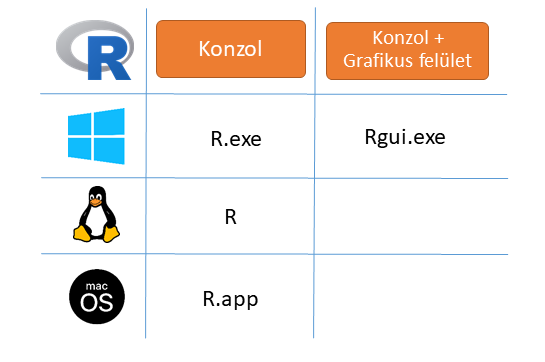
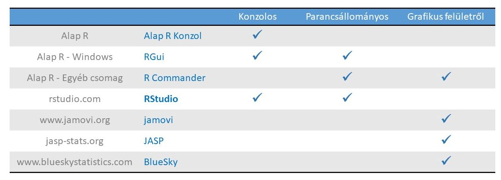
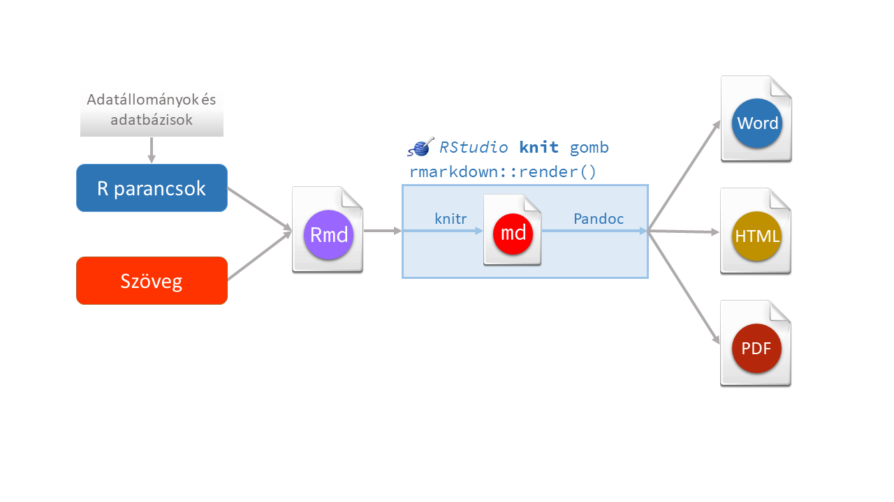

# Óravázlat

1. Dokumentációk megbeszélése: https://abarik.github.io/statisztika/
1. A munka feltételeinek megbeszélése (az R a gyakorlatban videótutorial alapján): 
    * Alap R
    * RStudio
    * RStudio alapbeállításai
    * a projektes használat
1. Az előzó féléves anyag áttekintése: `r_parancsok.html`
1. Az `r_parancsok.html`-ből egy konkrét példa megoldása `.R` kiterjesztésű parancsállomány: *Génexpressziós adatokból adott gének kiválasztása*
1. Az `.Rmd` kiterjesztésű RMarkdown állományok megbeszélése. Fontos segítség: [RStudio Cheatsheets](https://rstudio.com/resources/cheatsheets/)
1. Az RMarkdown fejléc szerkesztése
1. Az RMarkdown szövegek szerkesztése
    * Szöveg formázása (pl. címek, félkövér, dőlt, írógép, idézet, új sor, új bekezdés, felsorolás, számozás)
    * Latex képletek (bekezdés, inline)
    * Link és kép beszúrása
    * Táblázat beszúrása
    * Lábjegyzet beszúrása
    * Irodalomjegyzék és szövegközi hivatkozások beszúrása
1. Az RMarkdown R parancsok kezelése
    * Inline R parancsok
    * R csonkok
    


# Ismétlő példa megoldása

> **Génexpressziós adatokból adott gének kiválasztása**   
Olvassuk be a `data_RNA_Seq_v2_mRNA_median_Zscores_IDC_lumA_v2.txt` állományt, amely Luminal A betegekre vonatkozó génexpressziós adatokat tartalmaz. A sorokban az egy génre vonatkozó adatok találhatók. Az első oszlopban a gén neve, a további 200 oszlopban 200 beteg adata szerepel. A megjelenő számok a génkifejeződés mértéke az egészséges normához képest. Olvassuk be a gene_list.txt állományt is, amely a számunkra érdekes gének nevét tartalmazza, és ez alaján szűrjük le a fenti adatbázist (használjuk az `%in%` relációs operátort).


# Szöveg formázása

A mindennapi életben elénk kerülő adatok a legalapvetőbb természetük alapján legalább 4 csoportba sorolhatók, *számszerű* (numerikus), *karakteres* (sztring), *logikai* (állítások igazságtartalma, igaz vagy hamis) és *dátum/idő* jellegű adatokra. A statisztika tudománya is elvégzi az adatok csoportosítását, e szerint egyrészről megkülönböztetünk *nominális*, *ordinális*, *intervallum* és *arányskálájú* változókat (az alapján, hogy mit tudunk tenni a változó értékeivel), másrészt *diszkrét* és *folytonos* változókat (az alapján, hogy hány értéke van a változónak). Az adatok jellegének harmadik megközelítését adják az adott statisztikai programcsomag adattípusai, az R-ben például számunkra a legfontosabbak a **double**, **integer**, **karakteres**, **logikai**, **faktor**, **dátum** és **dátum-idő**. Az R nyelv adattípusait és kapcsolatukat a statisztikai változókategóriákkal és a mindennapi életben használt természetes felosztással a lenti táblázat tartalmazza.  
Az R adattípusokat az 1. oszlop listázza. Az `str()` és `glimpse()` függvényben az adattípus jelölésére használt rövidítések a 2. oszlopban találhatók. A statisztikai skálák és az R adattípusok lehetséges összerendelésit a 3. oszlop mutatja. E szerint **egy adatbázisban többnyire double, integer vagy faktor oszlopokat várunk**. A statisztikai változók számossága és az R adattípus közötti összefüggés a 4. oszlopban olvasható. Az utolsó oszlopban az adott adattípus mindennapi életben használatos természetét emeltük ki[^1].

A táblázat a 4.1.1 R verzió alapján készült.


# Táblázat beszúrása

Table: Az R adattípusainak jellemzése. 

R adattípus  | `str()`, `glimpse()` | Skála                       | Számosság             | Természet
-------------|----------------------|-----------------------------|-----------------------|-----------
double       | `num`, `dbl`         | intervallum/arány           | folytonos/diszkrét    | Numerikus
integer      | `int`, `int`         | ordinális/intervallum/arány | diszkrét              | Numerikus  
karakteres   | `chr`, `chr`         | -                           | -                     | Karakteres
logikai      | `logi`, `lgl`        | -                           | -                     | Logikai
faktor       | `Factor`, `fct`      | nominális/ordinális         | diszkrét (kategorikus)| Karakteres
dátum        | `Date`, `date`       | -                           | -                     | Dátum/idő 
dátum és idő | `POSIXct`,  `dttm`   | -                           | -                     | Dátum/idő  


```r
knitr::kable(
  iris[1:10, ], longtable = TRUE, booktabs = TRUE,
  caption = 'A table generated by the longtable package.'
)
```


Table: (\#tab:unnamed-chunk-1)A table generated by the longtable package.

| Sepal.Length| Sepal.Width| Petal.Length| Petal.Width|Species |
|------------:|-----------:|------------:|-----------:|:-------|
|          5.1|         3.5|          1.4|         0.2|setosa  |
|          4.9|         3.0|          1.4|         0.2|setosa  |
|          4.7|         3.2|          1.3|         0.2|setosa  |
|          4.6|         3.1|          1.5|         0.2|setosa  |
|          5.0|         3.6|          1.4|         0.2|setosa  |
|          5.4|         3.9|          1.7|         0.4|setosa  |
|          4.6|         3.4|          1.4|         0.3|setosa  |
|          5.0|         3.4|          1.5|         0.2|setosa  |
|          4.4|         2.9|          1.4|         0.2|setosa  |
|          4.9|         3.1|          1.5|         0.1|setosa  |


# Képek beszúrása


<div class="figure" style="text-align: center">

<p class="caption">(\#fig:unnamed-chunk-2)Az R kényelmes használata</p>
</div>

<div class="figure" style="text-align: center">

<p class="caption">(\#fig:unnamed-chunk-3)Az R kényelmes használata</p>
</div>


<div class="figure" style="text-align: right">

<p class="caption">(\#fig:unnamed-chunk-4)Az Alap R</p>
</div>


<div class="figure" style="text-align: center">

<p class="caption">(\#fig:unnamed-chunk-5)A konzolok</p>
</div>


<div class="figure" style="text-align: center">

<p class="caption">(\#fig:unnamed-chunk-6)Az R használati módjai</p>
</div>


<div class="figure" style="text-align: center">

<p class="caption">(\#fig:unnamed-chunk-7)Az RMarkdown működése</p>
</div>


```r
smoc2_rawcounts <- read.csv("data/fibrosis_smoc2_rawcounts_unordered.csv") 
rownames(smoc2_rawcounts) <- smoc2_rawcounts$X
smoc2_rawcounts$X <- NULL

# Explore the first six observations of smoc2_rawcounts
head(smoc2_rawcounts)
#>                    smoc2_fibrosis1 smoc2_fibrosis4
#> ENSMUSG00000102693               0               0
#> ENSMUSG00000064842               0               0
#> ENSMUSG00000051951              72              30
#> ENSMUSG00000102851               0               0
#> ENSMUSG00000103377               0               0
#> ENSMUSG00000104017               0               0
#>                    smoc2_normal1 smoc2_normal3
#> ENSMUSG00000102693             0             0
#> ENSMUSG00000064842             0             0
#> ENSMUSG00000051951             0             3
#> ENSMUSG00000102851             0             0
#> ENSMUSG00000103377             1             0
#> ENSMUSG00000104017             0             0
#>                    smoc2_fibrosis3 smoc2_normal4
#> ENSMUSG00000102693               0             0
#> ENSMUSG00000064842               0             0
#> ENSMUSG00000051951              36             1
#> ENSMUSG00000102851               0             0
#> ENSMUSG00000103377               0             0
#> ENSMUSG00000104017               0             0
#>                    smoc2_fibrosis2
#> ENSMUSG00000102693               0
#> ENSMUSG00000064842               0
#> ENSMUSG00000051951              51
#> ENSMUSG00000102851               0
#> ENSMUSG00000103377               0
#> ENSMUSG00000104017               0
# Explore the structure of smoc2_rawcounts
str(smoc2_rawcounts)
#> 'data.frame':	47729 obs. of  7 variables:
#>  $ smoc2_fibrosis1: int  0 0 72 0 0 0 0 0 0 1 ...
#>  $ smoc2_fibrosis4: int  0 0 30 0 0 0 0 0 0 1 ...
#>  $ smoc2_normal1  : int  0 0 0 0 1 0 0 0 0 1 ...
#>  $ smoc2_normal3  : int  0 0 3 0 0 0 0 0 0 0 ...
#>  $ smoc2_fibrosis3: int  0 0 36 0 0 0 0 0 0 1 ...
#>  $ smoc2_normal4  : int  0 0 1 0 0 0 0 0 0 0 ...
#>  $ smoc2_fibrosis2: int  0 0 51 0 0 0 0 0 0 1 ...
```

# R csonkok


```r
library(ggplot2)
ggplot(smoc2_rawcounts) + 
  geom_histogram(aes(x=smoc2_fibrosis1), bins = 300)
```


```r
summary(smoc2_rawcounts$smoc2_fibrosis1)
#>     Min.  1st Qu.   Median     Mean  3rd Qu.     Max. 
#>      0.0      0.0      1.0    579.7    184.0 420026.0
```

# Képletek beszúrása

Diszperziós formula: $Var=\mu+\alpha\times\mu^2$

- $Var$: variancia
- $\mu$: átlag
- $\alpha$: diszperzió


A negatív binomiális modell:

$$K_{ij} \sim NB(\mu_{ij},\alpha_i)$$
$$\mu_{ij}=s_{j}q_{ij}$$


$$log_2(q_{ij})=x_j\beta_j$$


- $K_{ij}$ - nyers count az i. génben a j. mintában
- $s_{ij}$ - size factor
- $g_{ij}$ - normalizált count


A mintaátlag kiszámítása: $\bar{x}=\frac{\sum_{i=1}^{n}x_i}{n}$

A minta szórása: $$s^*=\sqrt{\frac{\sum_{i=n}^{n}(x_i-\bar{x})^2}{n-1}}$$


# Hivatkozásra példák

A lenti workflow [@Pipperrana] alapján készült. Az elemzéshez a **DESeq2** csomagot használtuk [@Love2014] és figyelembe vettük @anrlove2020 [leírását](https://bioconductor.org/packages/release/bioc/vignettes/DESeq2/inst/doc/DESeq2.html) is. 

A workflow-ban használt kutatási kérdések és adatbázisok a @Gerarduzzi2017 publikációján alapulnak, az RNS-szekvenálási adatok a Gene Expression Omnibus (GEO) adatbázisból  letölthetők (GEO accession: [GSE85209](https://www.ncbi.nlm.nih.gov/geo/query/acc.cgi?acc=GSE85209)).

A szövegközi hivatkozás esetei:

* [@Love2014]
* @Love2014
* [-@Love2014]
* [@Love2014;  @Gerarduzzi2017]
* @Love2014 [p. 33] 
* [@Love2014, pp. 33-35; @Gerarduzzi2017, ch. 1]

# Irodalomjegyzék


[^1]: Természetesen más felosztás is elképezhető. 
